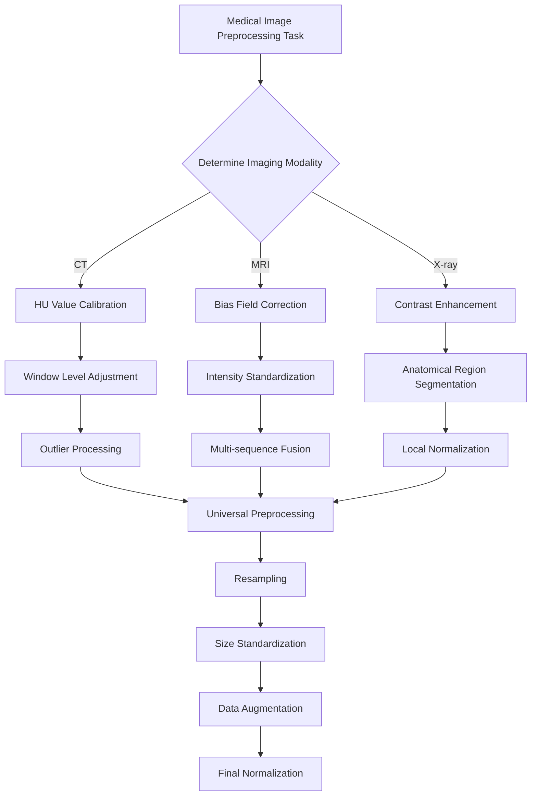

# 5.1 Preprocessing (with modality differences in mind)

## Opening question
This section answers: **why raw medical images cannot be fed directly into a model, and why different modalities need different preprocessing routes.**

> This mainline page answers the Chapter 5 question **"How should data be prepared?"** Full runnable scripts, dependencies, long logs, and generated outputs are collected in [5.6 Code Labs / Practice Appendix](./06-code-labs.md) and `src/ch05/README_EN.md`.

> "Good preprocessing is the foundation of successful deep learning models—garbage in, garbage out." — The Golden Rule of Medical Image AI

- even CT scans from different hospitals can have different spacing, orientation, and slice thickness;
- the same tissue can look very different across MRI scanners or protocols;
- a model may appear to train well while actually learning scanner differences instead of disease patterns.

So preprocessing is not just about “cleaning up images.” It is about turning raw data into inputs that are **comparable, learnable, and reproducible**.


## Intuitive explanation
A simple way to think about preprocessing is:

1. **put every scan on the same ruler first;**
2. **then suppress variations that are not relevant to the task.**

If we skip that first step, the model will see many differences that have nothing to do with disease:

- voxel size differences;
- orientation differences;
- intensity scales that are not comparable at all;
- artifacts, bias field, or noise hiding the real signal.

That is why preprocessing is not meant to make images look prettier. Its job is to help later segmentation, classification, and detection models learn the **stable medical signal** instead of nuisance variation.


*Figure: preprocessing usually starts with spatial normalization, then applies modality-specific intensity handling, and only then connects to downstream tasks.*


## Core method
This section only keeps the 4 most important moves.

### 1. Normalize space
Different scans can have very different spacing, orientation, and size. Common steps include:

- resampling to a target voxel spacing;
- standardizing orientation;
- cropping an ROI or padding to a fixed size.

### 2. Normalize intensity
Different modalities follow different rules, so one recipe should not be forced onto all images:

- **CT** usually preserves HU meaning and uses clipping, windowing, or normalization;
- **MRI** often needs bias correction and intensity standardization;
- **X-ray** often depends more on local contrast and dynamic range adjustment.

### 3. Reduce obvious interference
Noise, bias field, metal artifacts, and local degradation can easily mislead a model. Preprocessing often does not fully “solve” them; it lowers the strongest nuisance factors first.

### 4. Keep training and deployment consistent
Many pipelines fail not because of the model architecture, but because preprocessing differs between training and inference. Reliable workflows usually:

- put preprocessing parameters into scripts;
- save key metadata before and after processing;
- reuse the same rules across training, validation, and deployment.


## Typical case
### Case 1: CT lung nodule or organ analysis
- **Pain point**: the HU range is very wide, mixing air, soft tissue, bone, and metal.
- **Approach**: HU clipping → windowing/normalization → resampling to a common spacing.
- **Local code**:
  - `src/ch05/clip_hu_values/main.py`
  - `src/ch05/medical_image_resampling/main.py`
  - `src/ch05/detect_metal_artifacts/main.py`

### Case 2: MRI brain modeling
- **Pain point**: the same tissue may have different brightness across locations and scanners.
- **Approach**: bias correction → intensity normalization → unified size and resolution.
- **Local code**:
  - `src/ch05/n4itk_bias_correction/main.py`
  - `src/ch05/white_stripe_normalization/main.py`
  - `src/ch05/visualize_bias_field/main.py`

### Case 3: Multi-center training
- **Pain point**: the model may treat hospital or scanner identity as a label shortcut.
- **Approach**: fix spatial rules, fix intensity rules, and save preprocessing logs so training and inference stay aligned.


## Practice tips
The main text only keeps short snippets for intuition; the full implementations live in `src/ch05/`.

### 1. CT: clip extreme HU values back into the task range
```python
import numpy as np


def clip_hu(image, hu_min=-1000, hu_max=1000):
    image = np.asarray(image, dtype=np.float32)
    return np.clip(image, hu_min, hu_max)
```

### Lung Field Segmentation and Normalization

#### Clinical Significance of Lung Field Segmentation

**Lung field segmentation** is a key step in chest X-ray processing:

1. **Region focusing**: Focus processing on lung regions
2. **Background suppression**: Remove interference from regions outside lungs
3. **Standardization**: Standardize lung size and position across different patients
4. **Prior utilization**: Utilize lung anatomical prior knowledge

#### Deep Learning-based Lung Field Segmentation

```python
import torch
import torch.nn as nn

class LungSegmentationNet(nn.Module):
    """
    Simplified lung field segmentation network (U-Net architecture)
    """
    def __init__(self):
        super().__init__()

        # Encoder
        self.encoder = nn.Sequential(
            nn.Conv2d(1, 64, 3, padding=1),
            nn.ReLU(),
            nn.Conv2d(64, 64, 3, padding=1),
            nn.ReLU(),
            nn.MaxPool2d(2),

            nn.Conv2d(64, 128, 3, padding=1),
            nn.ReLU(),
            nn.Conv2d(128, 128, 3, padding=1),
            nn.ReLU(),
            nn.MaxPool2d(2),
        )

        # Decoder
        self.decoder = nn.Sequential(
            nn.ConvTranspose2d(128, 64, 2, stride=2),
            nn.ReLU(),
            nn.Conv2d(64, 64, 3, padding=1),
            nn.ReLU(),
            nn.ConvTranspose2d(64, 32, 2, stride=2),
            nn.ReLU(),
            nn.Conv2d(32, 1, 1),  # Output binary mask
            nn.Sigmoid()
        )

    def forward(self, x):
        encoded = self.encoder(x)
        decoded = self.decoder(encoded)
        return decoded

def lung_segmentation_preprocessing(image, lung_mask):
    """
    Preprocessing based on lung field segmentation
    """
    # Apply lung field mask
    lung_only = image * lung_mask

    # Calculate statistical parameters of lung region
    lung_pixels = image[lung_mask > 0.5]
    lung_mean = np.mean(lung_pixels)
    lung_std = np.std(lung_pixels)

    # Lung region normalization
    normalized_lungs = (lung_only - lung_mean) / (lung_std + 1e-6)

    # Full image reconstruction (non-lung regions set to 0)
    normalized_image = normalized_lungs

    return normalized_image, (lung_mean, lung_std)
```


## 🔧 Common Preprocessing Methods

### Resampling and Resolution Standardization

#### Why Resampling is Needed?

Medical images from different sources may have different spatial resolutions:

| Modality  | Typical Resolution                                | Resolution Variation Reasons                  |
| --------- | ------------------------------------------------- | --------------------------------------------- |
| **CT**    | 0.5-1.0mm (in-plane), 0.5-5.0mm (slice thickness) | Scanning protocols, reconstruction algorithms |
| **MRI**   | 0.5-2.0mm (anisotropic)                           | Sequence types, acquisition parameters        |
| **X-ray** | 0.1-0.2mm (detector size)                         | Magnification, detector type                  |

#### Resampling Methods

```python
import scipy.ndimage as ndimage
import SimpleITK as sitk

def resample_medical_image(image, original_spacing, target_spacing, method='linear'):
    """
    Medical image resampling
    """
    # Calculate scaling factor
    scale_factor = np.array(original_spacing) / np.array(target_spacing)
    new_shape = np.round(np.array(image.shape) * scale_factor).astype(int)

    if method == 'linear':
        # Linear interpolation (suitable for image data)
        resampled_image = ndimage.zoom(image, scale_factor, order=1)
    elif method == 'nearest':
        # Nearest neighbor interpolation (suitable for label data)
        resampled_image = ndimage.zoom(image, scale_factor, order=0)
    elif method == 'bspline':
        # B-spline interpolation (high quality)
        sitk_image = sitk.GetImageFromArray(image)
        sitk_image.SetSpacing(original_spacing)

        resampler = sitk.ResampleImageFilter()
        resampler.SetOutputSpacing(target_spacing)
        resampler.SetSize(new_shape.tolist())
        resampler.SetInterpolator(sitk.sitkBSpline)

        resampled = resampler.Execute(sitk_image)
        resampled_image = sitk.GetArrayFromImage(resampled)

    return resampled_image
```

### Data Augmentation: Medical-specific Techniques

#### Special Considerations for Medical Image Data Augmentation

Medical image data augmentation needs to consider:

1. **Anatomical reasonableness**: Augmented images must maintain anatomical correctness
2. **Clinical significance**: Augmentation should not alter key pathological features
3. **Modality characteristics**: Different modalities are suitable for different augmentation strategies

#### Spatial Transform Augmentation

```python
import numpy as np


def scale_factors(original_spacing, target_spacing):
    original_spacing = np.array(original_spacing, dtype=np.float32)
    target_spacing = np.array(target_spacing, dtype=np.float32)
    return original_spacing / target_spacing
```


*Medical image data augmentation effects*
*Source: [Pneumonia detection data augmentation with KAGGLE RSNA challenge](https://www.kaggle.com/code/pastorsoto/pneumonia-detection-data-augmentation)*


## 📊 Preprocessing Best Practices

### Preprocessing Workflow Selection Guide

#### Task-driven Preprocessing Strategy


*Figure: Decision flow for selecting appropriate preprocessing strategies based on imaging modality.*

<details>
<summary>📖 View Original Mermaid Code</summary>


</details>

### Common Pitfalls and Solutions

#### Preprocessing Pitfalls

| Pitfall Type                 | Specific Manifestation                 | Consequences                             | Solutions                             |
| ---------------------------- | -------------------------------------- | ---------------------------------------- | ------------------------------------- |
| **Over-smoothing**           | Using Gaussian filtering for denoising | Loss of details, small lesions disappear | Use edge-preserving denoising         |
| **Improper normalization**   | Global statistics normalization        | Abnormal regions suppressed              | Local or adaptive normalization       |
| **Information leakage**      | Using test set statistics              | Overly optimistic performance            | Use only training set statistics      |
| **Anatomical discontinuity** | Excessive spatial transforms           | Anatomical structure destruction         | Reasonable transform parameter limits |

#### Validation Strategies

```python
import numpy as np


def normalize_with_white_stripe(image, wm_mask):
    wm_values = image[wm_mask > 0]
    mean = wm_values.mean()
    std = wm_values.std() + 1e-6
    return (image - mean) / std
```


## 🖼️ Algorithm Demonstrations

Below we showcase the practical effects of our implemented preprocessing algorithms on real data. All code examples can be found and run in the [`ch05-code-examples`](https://github.com/datawhalechina/med-imaging-primer/tree/main/src/ch05/) directory.

### MRI Bias Field Visualization and Correction


*MRI bias field visualization: left - original image, center - estimated bias field, right - corrected image*

**Bias field correction performance comparison:**
- Gaussian method: MSE=0.0958, PSNR=10.2dB, SSIM=0.368
- Homomorphic method: MSE=0.1984, PSNR=7.0dB, SSIM=0.149
- Polynomial method: MSE=0.0663, PSNR=11.8dB, SSIM=0.545


*Performance comparison of different bias field correction methods, showing polynomial method performs best in this example*

### White Stripe Intensity Normalization


*White Stripe intensity normalization: showing original image, normalized result, difference comparison, and statistical analysis*

**Normalization effects for different MRI sequences:**
- T1 sequence: 7 white matter pixels, normalized mean 0.889
- T2 sequence: 6 white matter pixels, normalized mean 0.886
- FLAIR sequence: 10 white matter pixels, normalized mean 0.888


*White Stripe normalization effects for different MRI sequences, showing intensity distributions and normalization results*

### CLAHE Contrast Enhancement


*Effects of different CLAHE parameters, showing progressive enhancement from weak to strongest*

**CLAHE enhancement quantitative evaluation:**
- Contrast improvement factor: 1.05
- Dynamic range expansion factor: 1.33
- Information content improvement factor: 1.14
- Edge strength improvement factor: 18.19
- PSNR: 28.05 dB, SSIM: 0.566


*Detailed CLAHE enhancement analysis, including edge detection, intensity distribution, and enhancement effect evaluation*

### CT HU Value Clipping


*CT HU value clipping: showing soft tissue range (-200, 400 HU) clipping effect*

**Effects of different clipping strategies:**
- Full range [-1000, 1000]: clipping ratio 41.53%, highest information preservation
- Soft tissue range [-200, 400]: clipping ratio 84.13%, suitable for organ analysis
- Bone range [-200, 3000]: clipping ratio 82.91%, suitable for orthopedic applications
- Lung range [-1500, 600]: clipping ratio 1.31%, specialized for lung examination

### Metal Artifact Detection


*CT metal artifact detection: automatic detection of metal regions and artifact severity assessment*

**Detection effects of different thresholds:**
| Threshold (HU) | Detected Regions | Metal Pixels | Ratio | Severity |
| -------------- | ---------------- | ------------ | ----- | -------- |
| 2000           | 2                | 166          | 0.02% | Slight   |
| 3000           | 2                | 165          | 0.02% | Slight   |
| 4000           | 2                | 133          | 0.01% | Slight   |


*Comparison of metal artifact detection effects for different HU thresholds*

### Practical Application Recommendations

**Choosing appropriate preprocessing strategies:**

1. **Select core algorithms based on modality**
   - CT: HU value clipping + windowing adjustment
   - MRI: Bias field correction + White Stripe normalization
   - X-ray: CLAHE enhancement + local segmentation

2. **Parameter optimization principles**
   - Start conservatively, enhance gradually
   - Use cross-validation to determine optimal parameters
   - Combine quantitative evaluation with visual effects

3. **Quality check key points**
   - Maintain anatomical structure integrity
   - Avoid over-processing or information loss
   - Ensure processing results conform to medical common sense

**Code usage guide:**
Each algorithm has complete documentation and test cases. We recommend:
1. First run synthetic data examples to understand algorithm effects
2. Use your own data for parameter optimization
3. Establish quality check processes to ensure processing effects


## 🔑 Key Takeaways

1. **Modality Specificity**: Different imaging modalities require specialized preprocessing strategies
   - CT: Focus on HU value ranges and windowing
   - MRI: Address bias field and intensity normalization
   - X-ray: Focus on contrast enhancement and anatomical region processing

2. **Physical Meaning Preservation**: Preprocessing should not destroy the physical meaning of images
   - Absoluteness of HU values
   - Relativity of MRI signal intensities
   - Equipment dependency of X-ray intensities

3. **Clinical Reasonableness**: Preprocessing results must conform to medical common sense
   - Continuity of anatomical structures
   - Reasonableness of tissue contrast
   - Preservation of pathological features

4. **Data-driven Optimization**: Preprocessing parameters should be adjusted according to specific tasks and datasets
   - Cross-validation to determine optimal parameters
   - Combination of qualitative and quantitative evaluation
   - Consider computational efficiency balance

5. **Quality Assurance**: Establish preprocessing quality inspection mechanisms
   - Automated anomaly detection
   - Expert validation processes
   - Version control and reproducibility


## 🔗 Typical Medical Datasets and Paper URLs Related to This Chapter

:::details

### Datasets

| Dataset | Purpose | Official URL | License | Notes |
| --- | --- | --- | --- | --- |
| **BraTS** | Brain Tumor Multi-sequence MRI | https://www.med.upenn.edu/cbica/brats/ | Academic use free | Most authoritative brain tumor dataset |
| **LUNA16** | Lung Nodule Detection CT | https://luna16.grand-challenge.org/ | Public | Standard lung nodule dataset |
| **CheXpert** | Chest X-ray | https://stanfordmlgroup.github.io/competitions/chexpert/ | CC-BY 4.0 | Stanford standard dataset |
| **NIH CXR14** | Chest X-ray | https://nihcc.app.box.com/v/ChestX-ray14 | Public | Contains disease labels |
| **TCIA** | Multi-modality Tumor Data | https://www.cancerimagingarchive.net/ | Public | Tumor imaging dataset |
| **OpenI** | Chest X-ray and Radiology Reports | https://openi.nlm.nih.gov/ | Public | Contains radiology report associations |

### Papers

| Paper Title | Keywords | Source | Notes |
| --- | --- | --- | --- |
| **Preparing CT imaging datasets for deep learning in lung nodule analysis: Insights from four well-known datasets** | CT imaging dataset preparation | [Heliyon](https://www.sciencedirect.com/science/article/pii/S2405844023043128) | Guide for CT lung nodule dataset preparation for deep learning |
| **Hounsfield unit (HU) value truncation and range standardization** | HU value truncation and standardization | [Medical Imaging Preprocessing Standards](https://radiopaedia.org/articles/hounsfield-unit) | Theoretical foundation of CT intensity standardization |
| **CLAHE (Contrast Limited Adaptive Histogram Equalization)** | CLAHE contrast enhancement | [IEEE Transactions on Image Processing 1997](https://ieeexplore.ieee.org/document/109340) | Contrast-limited adaptive histogram equalization |
| **U-Net: Convolutional Networks for Biomedical Image Segmentation** | U-Net architecture | [MICCAI 2015](https://doi.org/10.1007/978-3-319-24574-4_28) | Classic network for medical image segmentation |
| **A review of deep learning in medical imaging: Imaging traits, technology trends, case studies with progress highlights, and future promises** | Deep learning medical imaging review | [arXiv](https://arxiv.org/pdf/2008.09104) | Comprehensive review of deep learning techniques in medical imaging |

### Open Source Libraries

| Library | Function | GitHub/Website | Purpose |
| --- | --- | --- | --- |
| **TorchIO** | Medical Image Transformation Library | https://torchio.readthedocs.io/ | Medical image data augmentation |
| **Albumentations** | Medical Image Augmentation | https://albumentations.ai/ | General image augmentation |
| **SimpleITK** | Medical Image Processing | https://www.simpleitk.org/ | Medical image processing toolkit |
| **ANTs** | Medical Image Registration | https://stnava.github.io/ANTs/ | Image registration and analysis |
| **MEDpy** | Medical Image Processing | https://github.com/loli/MEDpy | Medical imaging algorithm library |
| **NiBabel** | DICOM/NIfTI Processing | https://nipy.org/nibabel/ | Neuroimaging data format processing |

:::

The next section moves to segmentation because once the input is under control, we can ask a finer question: **how can a model produce a pixel-level answer for where an organ or lesion actually is?**
