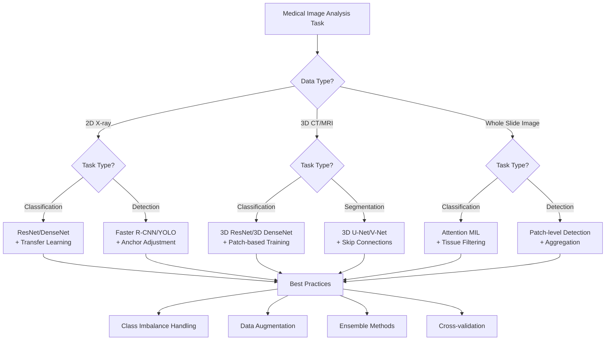

# 5.3 Classification and Detection

> This mainline page answers the Chapter 5 question **"How should we think about classification and detection?"** For runnable demos, complete outputs, and experiment entry points, continue to [5.6 Code Labs / Practice Appendix](./06-code-labs.md) and `src/ch05/README_EN.md`.

> "Medical image classification and detection are moving from computer-aided detection (CADe) to computer-aided diagnosis (CADx), and gradually becoming an important assistant for clinicians." — — Litjens et al., "A survey on deep learning in medical image analysis", Medical Image Analysis 2017

In the previous sections, we learned in detail about preprocessing techniques and U-Net-based segmentation methods. Now, we enter another important area of medical image analysis: **classification and detection**. Unlike the pixel-level precision requirements of segmentation, classification and detection focus more on accurately identifying diseases and locating lesions.

Medical image classification and detection face unique challenges: extreme class imbalance (the ratio of positive to negative samples can reach 1:1000), tiny lesion sizes, image quality variations, and the need for high precision and recall. In this section, we will explore how to use deep learning technology to solve these problems.


## 🔍 Classification vs Detection: Core Concepts and Differences

### Basic Task Definition

#### Image Classification

**Image classification** determines whether an image contains specific disease or abnormality:

- **Binary classification**: Normal vs Abnormal
- **Multi-class classification**: Specific disease type identification
- **Multi-label classification**: An image may contain multiple diseases

#### Object Detection

**Object detection** not only identifies diseases but also determines their location:

- **Bounding box detection**: Frame the lesion area
- **Lesion localization**: Provide precise coordinates
- **Multi-lesion detection**: Detect multiple lesions simultaneously

| Task Type | Input | Output | Clinical Application | Difficulty Level |
|-----------|-------|--------|---------------------|-----------------|
| **Classification** | Complete medical image | Disease label/category | Initial screening, triage |  |
| **Detection** | Complete medical image | Bounding box + category | Lesion localization, surgical planning |  |
| **Segmentation** | Complete medical image | Pixel-level mask | Precise measurement, 3D reconstruction |  |

### Medical Particularities

#### Class Imbalance Problem in Medical Imaging

Class imbalance is a fundamental challenge in medical image classification. Unlike natural image datasets, medical datasets exhibit extreme imbalance due to inherent clinical characteristics.

##### Root Causes of Medical Class Imbalance

1. **Disease Prevalence Characteristics**
   - Most diseases have very low prevalence in general populations
   - Example: Cancer typically affects 0.5-2% of screened population
   - Example: Tuberculosis affects <1% in low-prevalence regions
   - **Clinical Reality**: Screening data naturally reflects population disease prevalence

2. **Data Collection Bias**
   - Medical imaging is expensive and resource-intensive
   - Positive (diseased) cases are actively collected for research
   - Negative (normal) cases are passively collected from routine screening
   - **Result**: Dataset distribution is more skewed than true population distribution

3. **Annotation Cost Asymmetry**
   - Normal cases can be easily labeled as "healthy"
   - Abnormal cases require expert radiologist review
   - Complex cases need multiple expert consensus
   - **Economic Impact**: High cost makes balanced datasets economically unfeasible

##### Severe Impact of Class Imbalance on Model Training

| Impact Category | Problem Description | Consequence | Clinical Risk |
|---|---|---|---|
| **Prediction Bias** | Model biased toward majority class | Majority class prediction dominates, minority class ignored | High false negative rate (missing rare diseases) |
| **Decision Threshold Mismatch** | Decision thresholds optimized for majority class | Minority class confidence scores unreliable | Inappropriate clinical decisions |
| **Feature Learning Distortion** | Minority class features under-learned | Model learns superficial patterns instead of medical characteristics | Poor generalization to new data |
| **Evaluation Metric Misleading** | Overall accuracy high even with poor minority class performance | 99% accuracy could mean missing 100% of disease cases if disease is 1% prevalence | False sense of model reliability |

Readers often face pain points like these:

- chest X-ray screening only needs a first abnormal/normal decision;
- emergency triage cares more about high recall than fine delineation;
- large-scale screening needs fast routing before detailed review.

So not every problem should jump straight to segmentation. In many medical AI workflows, classification and detection are the first gate.


## Intuitive explanation
A simple way to frame this section is as three levels of questions:

- **classification** answers “whether / what”;
- **detection** answers “where”;
- **segmentation** answers “where exactly is the boundary.”

Classification models focus on image-wide patterns related to diagnosis. Detection builds on classification and learns to provide rough location information as well.

The hard part in medicine is not only model architecture. It is also that:

- positive cases are much rarer than negative ones;
- tiny lesions may occupy only a tiny fraction of the image;
- clinicians want more than a score—they want something they can inspect and question.


*Figure: classification emphasizes image-level diagnostic patterns, while detection adds explicit localization of suspicious regions.*


## Core method
This section keeps only 4 key ideas.

### 1. Decide whether you need a global label or candidate locations
If the goal is screening, triage, or first-pass warning, classification may be enough. If clinicians need quick review of suspicious regions, detection is often a better fit.

### 2. Put recall first when the task demands it
In medical screening especially, it is often better to flag extra suspicious cases than to miss a serious lesion.

### 3. Handle class imbalance explicitly
Rare positives are the norm. Resampling, weighted losses, and threshold tuning often matter earlier than swapping the backbone.

### 4. Make outputs reviewable
Probabilities, heatmaps, confusion matrices, ROC/AUC curves, and error analysis all help clinicians judge whether the model is trustworthy.


## Typical case
### Case 1: Binary or multi-label chest X-ray classification
- **Goal**: predict normal/abnormal, pneumonia, effusion, nodules, and similar labels.
- **Difficulty**: positive cases are sparse and many abnormalities occupy only a small region.
- **Local code**: `src/ch05/medical_image_classification/main.py`.

### Case 2: Lesion detection as a triage entry point
- **Goal**: provide candidate boxes for a clinician or a later segmentation model to review.
- **Suitable for**: lung nodules, breast calcifications, suspicious fractures, and similar findings.
- **Section focus**: build the intuition for classification first, then see why detection must additionally learn location.

### Case 3: Model interpretation and error analysis
- **Goal**: understand not just the score, but where the model is looking.
- **Suggested outputs**: prediction probabilities, confusion matrix, ROC/AUC, heatmaps, or attention maps.
- **Local result file**: `src/ch05/medical_image_classification/output/medical_classification_report.json`.


## Practice tips
The text only keeps short fragments for intuition; the full network, training loop, and visualizations are in the local scripts.

### 1. Minimal classification head
```python
import torch.nn as nn


def classification_head(in_features, num_classes):
    return nn.Sequential(
        nn.Linear(in_features, 256),
        nn.ReLU(inplace=True),
        nn.Dropout(0.5),
        nn.Linear(256, num_classes),
    )
```


## 📊 Performance Comparison and Best Practices

### Evaluation Metrics

#### Classification Metrics

```python
import torch
import torch.nn.functional as F


def weighted_ce(logits, targets, class_weights):
    return F.cross_entropy(logits, targets, weight=torch.tensor(class_weights))
```

### 3. Convert logits into readable probabilities
```python
import torch


def to_probabilities(logits):
    return torch.softmax(logits, dim=1)
```

### Model Selection Guidelines

#### Task-driven Model Selection


*Figure: Selecting appropriate deep learning models based on medical image data types (2D X-ray, 3D CT/MRI, WSI whole slide images) and task types *

<details>
<summary>📖 View Original Mermaid Code</summary>


</details>

#### Performance Comparison

| Model | Data Type | Task | mAP/Accuracy | Memory Usage | Training Time | Clinical Applicability |
|-------|-----------|------|--------------|--------------|---------------|---------------------|
| **ResNet50** | 2D X-ray | Classification | 0.85-0.92 | 2GB | Medium |  |
| **DenseNet121** | 2D X-ray | Classification | 0.87-0.94 | 2.5GB | Medium |  |
| **3D ResNet** | 3D CT/MRI | Classification | 0.82-0.89 | 8GB | High |  |
| **Faster R-CNN** | 2D X-ray | Detection | 0.78-0.85 | 4GB | High |  |
| **YOLOv5** | 2D X-ray | Detection | 0.75-0.82 | 1.5GB | Low |  |
| **Attention MIL** | WSI | Classification | 0.80-0.88 | 6GB | Very High |  |


## 🎯 Technical Insights & Future Trends

### 1. Classification Techniques
- **2D CNN** for X-ray: ResNet, DenseNet-based transfer learning
- **3D CNN** for volumetric data: 3D ResNet, memory optimization strategies
- **Data imbalance handling**: Focal Loss, balanced sampling

### 2. Detection Strategies
- **Classic frameworks**: Faster R-CNN, YOLO medical adaptation
- **Medical-specific**: Hard negative mining, anchor adjustment
- **Evaluation metrics**: mAP, IoU, clinical indicators

### 3. Whole Slide Image Analysis
- **MIL framework**: Attention mechanism, instance-level learning
- **Memory efficiency**: Patch-based processing, caching strategy
- **Interpretability**: Attention map visualization

### 4. Best Practices
- **Clinical requirements**: Accuracy first, speed second
- **Data quality**: High-quality annotation, multi-center validation
- **Regulatory compliance**: Model interpretability, decision support

### 5. Future Trends
- **Multimodal fusion**: Comprehensive analysis combining imaging and clinical data
- **Weakly supervised learning**: Reducing annotation requirements
- **Federated learning**: Multi-center collaboration, privacy protection


## 🔗 Typical Medical Datasets and Paper URLs Related to This Chapter

:::details

### Datasets

| Dataset | Purpose | Official URL | License | Notes |
| --- | --- | --- | --- | --- |
| **NIH ChestX-ray14** | Chest X-ray Classification Detection | https://nihcc.app.box.com/v/ChestX-ray14 | Public | Contains 14 types of chest disease labels |
| **CheXpert** | Chest X-ray Classification | https://stanfordmlgroup.github.io/competitions/chexpert/ | CC-BY 4.0 | Stanford standard dataset, with 5 abnormality labels |
| **MIMIC-CXR** | Chest X-ray Multi-label Classification | https://physionet.org/content/mimic-cxr-jpg/2.0.0/ | MIT License | Real clinical data from Boston Children's Hospital |
| **PadChest** | Chest X-ray + Clinical Data | https://bimcv.cipf.es/bimcv-projects/padchest/ | CC BY 4.0 | Contains 100,000 X-ray images with clinical reports |
| **DeepLesion** | Lesion Detection Dataset | https://wiki.cancerimagingarchive.net/pages/viewpage.action?pageId=53683303 | Public | Contains annotated data for various body lesions |
| **MedicalDecathlon** | Multi-organ Classification Segmentation | https://medicaldecathlon.com/ | CC BY-SA 4.0 | 10 organs' CT/MRI dataset |
| **ChestX-Ray8** | Chest Disease Classification | https://www.kaggle.com/paultimothymooney/chest-xray-pneumonia | Public | Contains pneumonia, normal X-ray images |
| **ISIC Archive** | Skin Lesion Classification | https://www.isic-archive.com/#!/topWithHeader/onlyHeaderTop/gallery | Public | Dermoscopy image classification benchmark |

### Papers

| Paper Title | Keywords | Source | Notes |
| --- | --- | --- | --- |
| **CheXNet: Radiologist-Level Pneumonia Detection on Chest X-Rays with Deep Learning** | Chest X-ray Pneumonia Detection | [arXiv:1711.05225](https://arxiv.org/abs/1711.05225) | Stanford University, using 121-layer DenseNet |
| **Focal Loss for Dense Object Detection** | Focal Loss Loss Function | [arXiv:1708.02002](https://arxiv.org/abs/1708.02002) | Classic loss function paper addressing class imbalance |

### Open Source Libraries

| Library | Function | GitHub/Website | Purpose |
| --- | --- | --- | --- |
| **MONAI** | Medical Imaging Deep Learning Framework | https://monai.io/ | PyTorch library designed specifically for medical imaging, including classification, detection, and segmentation tools |
| **TorchIO** | Medical Image Transformation Library | https://torchio.readthedocs.io/ | Supports multiple medical image formats and enhancement transformations |
| **deepmedic** | 3D Medical Image Classification | https://github.com/DeepMedic/deepmedic | High-performance 3D medical image classification framework, especially suitable for brain images |
| **Grad-CAM++** | Explainable Visualization | https://github.com/jacobgil/grad-cam-plus-plus | Attention visualization tool for medical image classification |

:::


The next section moves to augmentation and restoration because the first three sections quietly assume the input is already “usable.” In reality, we still need to ask: **what do we do when data are scarce, image quality is poor, or contrast is not strong enough?**
