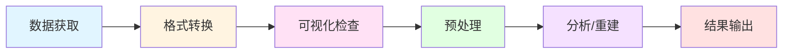
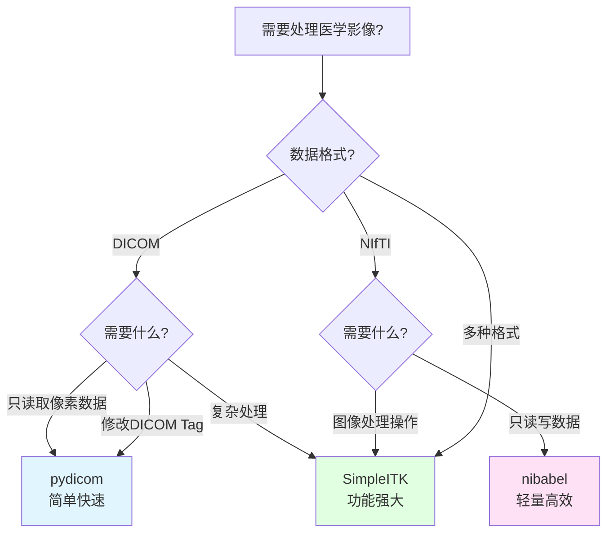
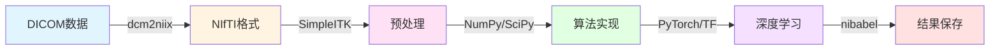
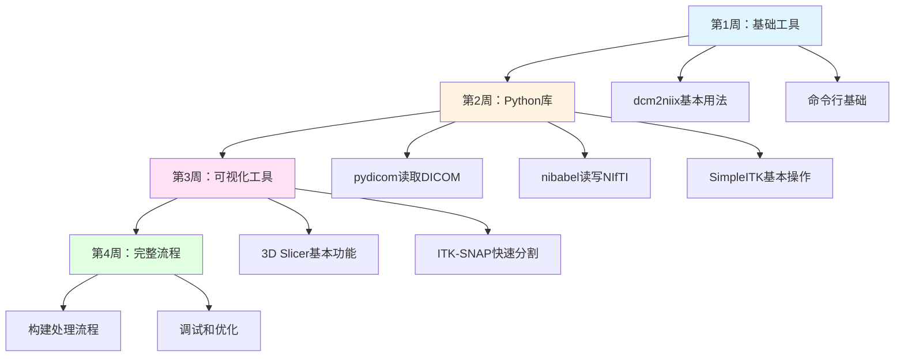

# 1.3 常用开源工具

> "工具不是目的，而是通往理解的桥梁。选择正确的工具，能让你专注于问题本身，而非技术细节。" —— 开源精神的体现

想象这样一个场景：你刚加入一个医学影像研究团队，导师给了你一个硬盘，里面有1000个患者的CT扫描DICOM文件。你的任务是：将这些数据转换为NIfTI格式，检查数据质量，提取肺部区域，最后训练一个深度学习模型。

面对这个任务，你可能会问：
- 用什么工具转换DICOM到NIfTI？命令行工具还是Python脚本？
- 如何快速可视化检查1000个扫描的质量？
- 哪个Python库最适合读取和处理医学影像？
- 需要安装哪些软件？它们之间如何配合？

本章将带你了解医学影像处理的开源工具生态，帮助你根据具体场景快速选择合适的工具，为后续章节的深入学习打下坚实基础。

---

## 🗺️ 医学影像处理工作流程与工具地图

### 典型工作流程

一个完整的医学影像处理项目通常包含以下阶段：



**各阶段的核心任务**：
- **数据获取**：从PACS系统、研究数据库或公开数据集获取原始数据
- **格式转换**：将DICOM转换为研究常用的格式（NIfTI、NRRD等）
- **可视化检查**：快速浏览数据，发现扫描伪影、标注错误等问题
- **预处理**：去噪、配准、重采样、归一化等操作
- **分析/重建**：实现核心算法（重建、分割、配准等）
- **结果输出**：生成报告、可视化结果、保存处理后的数据

### 工具分类矩阵

下表展示了不同类型工具在各个阶段的适用性：

| 工具类型 | 格式转换 | 可视化 | 预处理 | 算法实现 | 典型代表 |
|---------|---------|--------|--------|---------|---------|
| **命令行工具** | ⭐⭐⭐⭐⭐ | ⭐⭐ | ⭐⭐⭐ | ⭐⭐ | dcm2niix, FSL |
| **Python库** | ⭐⭐⭐⭐ | ⭐⭐⭐ | ⭐⭐⭐⭐⭐ | ⭐⭐⭐⭐⭐ | pydicom, SimpleITK |
| **GUI软件** | ⭐⭐⭐ | ⭐⭐⭐⭐⭐ | ⭐⭐⭐⭐ | ⭐⭐⭐ | 3D Slicer, ITK-SNAP |
| **完整平台** | ⭐⭐⭐⭐ | ⭐⭐⭐⭐ | ⭐⭐⭐⭐⭐ | ⭐⭐⭐⭐ | FreeSurfer, FSL |

::: tip 💡 工具选择的黄金法则
- **简单任务用命令行**：批量转换、标准化流程
- **复杂逻辑用Python**：需要条件判断、循环、与其他库集成
- **交互探索用GUI**：数据质量检查、参数调优、演示展示
- **完整流程用平台**：标准化的分析流程（如FreeSurfer的皮层重建）
:::

---

## 🔧 核心工具深度解析

### 1. 格式转换工具

#### dcm2niix：DICOM转换的事实标准

**官方资源**：
- 🌐 GitHub仓库：https://github.com/rordenlab/dcm2niix
- 📖 文档：https://github.com/rordenlab/dcm2niix/blob/master/README.md

**设计理念**：
dcm2niix由Chris Rorden开发，目标是提供最快速、最准确的DICOM到NIfTI转换工具。它用C++编写，没有外部依赖，可以在几秒钟内处理数千个DICOM文件。

**核心优势**：
- **速度极快**：C++实现，比Python脚本快10-100倍
- **自动化处理**：自动识别DICOM层次结构（Patient → Study → Series → Instance）
- **元数据保留**：输出JSON格式的元数据文件，保留关键扫描参数
- **广泛兼容**：支持Siemens、GE、Philips、Canon等主流厂商的DICOM格式
- **BIDS友好**：输出文件命名符合Brain Imaging Data Structure标准

**适用场景**：
- ✅ 批量转换研究数据集
- ✅ 构建自动化处理流程
- ✅ 需要保留完整元数据
- ❌ 需要在Python脚本中嵌入转换逻辑（用SimpleITK）
- ❌ 需要交互式调整参数（用3D Slicer）

**最小示例**：
```bash
# 基本用法：转换单个目录
dcm2niix -o output_dir input_dir

# 高级用法：自定义文件命名
dcm2niix -o output_dir -f "%p_%s_%t" input_dir
# %p = 患者姓名, %s = 序列描述, %t = 时间

# 输出压缩格式并保留元数据
dcm2niix -z y -b y -o output_dir input_dir
```

**与其他工具对比**：

| 工具 | 速度 | 元数据保留 | 易用性 | 跨平台 | 推荐度 |
|------|------|-----------|--------|--------|--------|
| **dcm2niix** | ⭐⭐⭐⭐⭐ | ⭐⭐⭐⭐⭐ | ⭐⭐⭐⭐ | ⭐⭐⭐⭐⭐ | 首选 |
| **MRIcron** | ⭐⭐⭐ | ⭐⭐⭐ | ⭐⭐⭐⭐⭐ | ⭐⭐⭐⭐ | GUI用户 |
| **pydicom** | ⭐⭐ | ⭐⭐⭐⭐⭐ | ⭐⭐⭐ | ⭐⭐⭐⭐⭐ | 需要定制 |
| **SimpleITK** | ⭐⭐⭐ | ⭐⭐⭐⭐ | ⭐⭐⭐ | ⭐⭐⭐⭐⭐ | Python集成 |

::: warning ⚠️ 常见陷阱
1. **多回波序列**：dcm2niix会为每个回波生成单独的NIfTI文件，需要手动合并
2. **增强扫描**：动态增强扫描可能被拆分为多个时间点，检查输出的JSON文件确认
3. **坐标系统**：默认输出RAS+坐标系统，与某些软件（如FSL）的默认不同
:::

---

### 2. Python生态系统

Python是医学影像处理最流行的编程语言，拥有丰富的工具库。以下是三个核心库的深入介绍。

#### pydicom：DICOM的Python接口

**官方资源**：
- 🌐 官方网站：https://pydicom.github.io/
- 📦 GitHub仓库：https://github.com/pydicom/pydicom
- 📖 文档：https://pydicom.github.io/pydicom/stable/

**设计理念**：
pydicom是纯Python实现的DICOM标准库，目标是提供对DICOM标准所有功能的完整访问。它不依赖外部C/C++库，易于安装和调试。

**核心优势**：
- **完整的DICOM支持**：支持读取、修改、创建DICOM文件
- **灵活的Tag访问**：可以通过Tag名称或编号访问元数据
- **纯Python实现**：易于集成到现有项目，无编译依赖
- **活跃的社区**：GitHub上有超过4000个star，问题响应迅速

**适用场景**：
- ✅ 需要读取/修改特定DICOM Tag
- ✅ 构建自动化DICOM处理流程
- ✅ 与Pandas/NumPy集成进行数据分析
- ✅ 开发DICOM网络服务（配合pynetdicom）
- ❌ 需要高性能图像处理（用SimpleITK）

**最小示例**：
```python
import pydicom
import numpy as np

# 读取DICOM文件
ds = pydicom.dcmread("ct_scan.dcm")

# 访问元数据
print(f"患者姓名: {ds.PatientName}")
print(f"扫描日期: {ds.StudyDate}")
print(f"层厚: {ds.SliceThickness} mm")

# 获取像素数据
pixel_array = ds.pixel_array  # 返回NumPy数组

# 应用窗宽窗位
slope = ds.RescaleSlope if hasattr(ds, 'RescaleSlope') else 1
intercept = ds.RescaleIntercept if hasattr(ds, 'RescaleIntercept') else 0
hu_array = pixel_array * slope + intercept  # 转换为HU值
```

::: details 🔍 常见陷阱与解决方案
**陷阱1：像素数据未自动缩放**
```python
# ❌ 错误：直接使用pixel_array
pixel_array = ds.pixel_array  # 可能是原始存储值

# ✅ 正确：应用RescaleSlope和RescaleIntercept
hu_array = ds.pixel_array * ds.RescaleSlope + ds.RescaleIntercept
```

**陷阱2：压缩DICOM无法读取**
```python
# 解决方案：安装解压缩库
# pip install pylibjpeg pylibjpeg-libjpeg pylibjpeg-openjpeg
```

**陷阱3：不处理DICOM层次结构**
```python
# pydicom只读取单个文件，需要自己遍历目录
import os
from pathlib import Path

dicom_files = []
for root, dirs, files in os.walk("dicom_dir"):
    for file in files:
        if file.endswith(".dcm"):
            dicom_files.append(os.path.join(root, file))
```
:::

---

#### nibabel：神经影像的瑞士军刀

**官方资源**：
- 🌐 官方网站：https://nipy.org/nibabel/
- 📦 GitHub仓库：https://github.com/nipy/nibabel
- 📖 文档：https://nipy.org/nibabel/manual.html

**设计理念**：
nibabel（NeuroimagingBabel）旨在提供统一的接口访问多种神经影像格式。它是NiPy（Neuroimaging in Python）项目的核心组件，专注于正确处理医学影像的坐标系统和仿射变换。

**核心优势**：
- **多格式支持**：NIfTI、GIFTI、CIFTI、MGH、MINC、Analyze等
- **坐标系统正确性**：正确处理仿射矩阵，避免左右翻转等常见错误
- **与NumPy无缝集成**：数据以NumPy数组形式返回
- **延迟加载**：支持大文件的内存高效处理

**适用场景**：
- ✅ 神经影像研究（fMRI、DTI、结构像）
- ✅ 需要处理坐标系统转换
- ✅ 与scikit-learn/PyTorch/TensorFlow集成
- ✅ 读写NIfTI格式（最常用）
- ❌ 需要复杂的图像处理操作（用SimpleITK）

**最小示例**：
```python
import nibabel as nib
import numpy as np

# 读取NIfTI文件
img = nib.load("brain.nii.gz")

# 获取数据数组
data = img.get_fdata()  # 返回NumPy数组，形状如(256, 256, 180)

# 获取仿射矩阵（体素坐标 → 世界坐标）
affine = img.affine
print(f"体素大小: {img.header.get_zooms()}")  # 如(1.0, 1.0, 1.0) mm

# 修改数据并保存
data_modified = data * 2  # 简单的强度缩放
img_new = nib.Nifti1Image(data_modified, affine, img.header)
nib.save(img_new, "brain_modified.nii.gz")
```

**坐标系统处理**：
```python
# 将体素坐标转换为世界坐标
voxel_coords = np.array([100, 100, 90, 1])  # 齐次坐标
world_coords = affine @ voxel_coords
print(f"世界坐标: {world_coords[:3]}")  # 输出RAS+坐标

# 获取图像方向信息
orientation = nib.aff2axcodes(affine)
print(f"图像方向: {orientation}")  # 如('R', 'A', 'S')
```

::: tip 💡 NIfTI-1 vs NIfTI-2
- **NIfTI-1**：最常用，文件头348字节，支持最大32767体素
- **NIfTI-2**：2011年发布，文件头540字节，支持更大的图像尺寸
- nibabel自动识别两种格式，无需手动指定
:::

---

#### SimpleITK：工业级图像处理库

**官方资源**：
- 🌐 官方网站：https://simpleitk.org/
- 📦 GitHub仓库：https://github.com/SimpleITK/SimpleITK
- 📖 文档：https://simpleitk.readthedocs.io/
- 📓 Jupyter教程：https://github.com/InsightSoftwareConsortium/SimpleITK-Notebooks

**设计理念**：
SimpleITK是ITK（Insight Segmentation and Registration Toolkit）的简化接口，提供Python、R、Java、C#等多语言绑定。它将ITK强大的图像处理功能封装为易用的API，同时保持高性能。

**核心优势**：
- **几乎支持所有医学影像格式**：DICOM、NIfTI、NRRD、MetaImage等
- **内置丰富算法**：配准、分割、滤波、形态学操作
- **C++后端**：性能优异，适合处理大规模数据
- **完整的教程**：官方提供100+个Jupyter Notebook教程

**适用场景**：
- ✅ 需要复杂的图像处理操作（配准、分割、滤波）
- ✅ 多模态配准
- ✅ 构建完整的处理流程
- ✅ 需要高性能处理大规模数据
- ❌ 只需要简单的读写操作（用nibabel更轻量）

**最小示例**：
```python
import SimpleITK as sitk

# 读取图像（自动识别格式）
image = sitk.ReadImage("ct.nii.gz")

# 获取图像信息
print(f"图像尺寸: {image.GetSize()}")
print(f"体素间距: {image.GetSpacing()}")
print(f"图像原点: {image.GetOrigin()}")

# 转换为NumPy数组
array = sitk.GetArrayFromImage(image)  # 注意：轴顺序为(z, y, x)

# 图像重采样
new_spacing = [1.0, 1.0, 1.0]  # 目标体素间距
resampler = sitk.ResampleImageFilter()
resampler.SetOutputSpacing(new_spacing)
resampler.SetInterpolator(sitk.sitkLinear)
resampled = resampler.Execute(image)

# 保存结果
sitk.WriteImage(resampled, "ct_resampled.nii.gz")
```

**高级功能示例**：
```python
# 图像配准
fixed = sitk.ReadImage("ct_fixed.nii.gz")
moving = sitk.ReadImage("ct_moving.nii.gz")

# 使用刚体配准
registration_method = sitk.ImageRegistrationMethod()
registration_method.SetMetricAsMeanSquares()
registration_method.SetOptimizerAsRegularStepGradientDescent(
    learningRate=1.0,
    minStep=0.001,
    numberOfIterations=200
)
registration_method.SetInterpolator(sitk.sitkLinear)

transform = registration_method.Execute(fixed, moving)
registered = sitk.Resample(moving, fixed, transform)
```

::: warning ⚠️ NumPy数组轴顺序
SimpleITK和NumPy的轴顺序不同：
- **SimpleITK**：(x, y, z) - 符合医学影像习惯
- **NumPy**：(z, y, x) - 符合数组索引习惯

```python
# SimpleITK → NumPy
sitk_image = sitk.ReadImage("image.nii.gz")
numpy_array = sitk.GetArrayFromImage(sitk_image)  # 轴顺序变为(z, y, x)

# NumPy → SimpleITK
sitk_image_new = sitk.GetImageFromArray(numpy_array)  # 轴顺序恢复为(x, y, z)
sitk_image_new.CopyInformation(sitk_image)  # 复制spacing、origin等信息
```
:::

---

#### Python工具选择决策树



**快速选择指南**：

| 场景 | 推荐工具 | 理由 |
|------|---------|------|
| 读取DICOM元数据 | pydicom | 完整的DICOM标准支持 |
| 批量转换DICOM→NIfTI | dcm2niix | 速度最快，命令行友好 |
| 读写NIfTI文件 | nibabel | 轻量，坐标系统处理正确 |
| 图像配准/分割 | SimpleITK | 内置算法丰富 |
| 深度学习数据加载 | nibabel + PyTorch | 与深度学习框架集成好 |
| 构建完整处理流程 | SimpleITK | 一站式解决方案 |

::: tip 🤖 AI视角
**医学影像AI项目的工具链推荐**：
1. **数据收集**：pydicom（提取元数据，如窗宽窗位、层厚）
2. **格式转换**：dcm2niix（批量DICOM→NIfTI）
3. **训练阶段**：nibabel（快速读取）+ PyTorch DataLoader
4. **预处理**：SimpleITK（重采样、配准）或直接用NumPy
5. **可视化调试**：3D Slicer（检查数据质量、验证预测结果）
:::

---

### 3. 可视化与交互工具

医学影像处理不仅需要编程工具，还需要可视化软件来检查数据质量、调整参数、生成演示材料。以下是两个最流行的开源可视化工具。

#### 3D Slicer：医学影像的Photoshop

**官方资源**：
- 🌐 官方网站：https://www.slicer.org/
- 📖 文档：https://slicer.readthedocs.io/
- 💬 社区论坛：https://discourse.slicer.org/

**设计理念**：
3D Slicer是一个可扩展的医学影像平台，最初由哈佛医学院和MIT开发。它不仅是一个可视化工具，更是一个完整的研究平台，支持通过Python脚本和C++插件扩展功能。

**核心优势**：
- **强大的3D可视化**：支持多平面重建（MPR）、体绘制、表面渲染
- **丰富的插件生态**：超过200个扩展模块，涵盖配准、分割、量化等
- **Python脚本支持**：可以在Slicer内部运行Python脚本，自动化操作
- **DICOM支持**：内置DICOM浏览器，支持PACS连接
- **跨平台**：Windows、macOS、Linux全平台支持

**适用场景**：
- ✅ 交互式数据探索和质量检查
- ✅ 手动分割标注（如肿瘤勾画）
- ✅ 快速原型验证（测试算法效果）
- ✅ 生成演示材料（截图、视频）
- ✅ 教学演示
- ❌ 批量自动化处理（用命令行工具）
- ❌ 需要嵌入到Python流程（用SimpleITK）

**核心功能**：

| 功能模块 | 用途 | 典型应用 |
|---------|------|---------|
| **Data** | 数据加载与管理 | 导入DICOM、NIfTI等格式 |
| **Volumes** | 体数据可视化 | 调整窗宽窗位、多平面重建 |
| **Segmentation** | 图像分割 | 手动勾画、半自动分割 |
| **Registration** | 图像配准 | 多模态配准、时间序列配准 |
| **Quantification** | 定量分析 | 体积测量、密度统计 |
| **Extensions** | 扩展模块 | 安装第三方插件 |

**典型工作流程**：
```
1. 加载数据（File → Add Data）
2. 调整显示（Volumes模块：窗宽窗位）
3. 创建分割（Segmentation模块：手动勾画）
4. 导出结果（File → Save）
```

::: tip 💡 3D Slicer的学习曲线
3D Slicer功能强大但学习曲线陡峭。建议：
1. 从官方教程开始：https://slicer.readthedocs.io/en/latest/user_guide/getting_started.html
2. 观看YouTube视频教程
3. 在论坛提问：https://discourse.slicer.org/
4. 先掌握基本的加载、可视化、分割功能，再探索高级特性
:::

---

#### ITK-SNAP：专注于分割的轻量工具

**官方资源**：
- 🌐 官方网站：https://www.itksnap.org/
- 📖 文档：https://www.itksnap.org/pmwiki/pmwiki.php?n=Documentation.HomePage

**设计理念**：
ITK-SNAP由宾夕法尼亚大学开发，专注于医学影像的手动和半自动分割。它比3D Slicer更轻量，启动更快，界面更简洁，非常适合快速分割任务。

**核心优势**：
- **学习曲线平缓**：界面直观，易于上手
- **启动速度快**：比3D Slicer快5-10倍
- **专注分割**：提供多种分割工具（手动、半自动、自动）
- **蛇形活动轮廓**：经典的Snake算法实现
- **多标签支持**：可以同时分割多个结构

**适用场景**：
- ✅ 快速手动分割
- ✅ 教学演示（界面简洁）
- ✅ 需要快速启动的场景
- ❌ 需要复杂的图像处理流程（用3D Slicer）
- ❌ 需要插件扩展（用3D Slicer）

**3D Slicer vs ITK-SNAP 对比**：

| 特性 | 3D Slicer | ITK-SNAP |
|------|-----------|----------|
| **学习曲线** | 陡峭 | 平缓 |
| **功能范围** | 广泛（平台级） | 专注分割 |
| **插件生态** | 丰富（200+） | 有限 |
| **启动速度** | 慢（10-30秒） | 快（1-3秒） |
| **Python脚本** | 支持 | 不支持 |
| **推荐场景** | 研究平台 | 快速分割 |
| **社区支持** | 活跃 | 中等 |

::: info 💡 何时选择哪个工具？
- **选择3D Slicer**：需要完整的研究平台，愿意投入时间学习
- **选择ITK-SNAP**：只需要快速分割，追求简洁高效
- **两者都用**：用ITK-SNAP快速查看，用3D Slicer深入分析
:::

---

### 4. 命令行工具集

除了通用工具，神经影像领域还有三个历史悠久的"重量级"工具包：FSL、FreeSurfer和AFNI。它们提供了从预处理到统计分析的完整流程。

#### FSL、FreeSurfer、AFNI：神经影像三巨头

**官方资源**：
- 🌐 **FSL**：https://fsl.fmrib.ox.ac.uk/
- 🌐 **FreeSurfer**：https://surfer.nmr.mgh.harvard.edu/
- 🌐 **AFNI**：https://afni.nimh.nih.gov/

**共同特点**：
- 命令行为主（也有GUI组件）
- 专注于神经影像分析（fMRI、DTI、结构像）
- 包含完整的处理流程（预处理 → 分析 → 统计）
- 学习曲线陡峭，但功能强大
- 在学术界广泛使用

**工具对比**：

| 工具 | 擅长领域 | 学习曲线 | 社区支持 | 典型应用 |
|------|---------|---------|---------|---------|
| **FSL** | 功能MRI、扩散MRI | 中等 | 优秀 | fMRI分析、DTI纤维追踪 |
| **FreeSurfer** | 皮层重建、形态学 | 陡峭 | 优秀 | 皮层厚度、脑区分割 |
| **AFNI** | 功能MRI、统计分析 | 陡峭 | 良好 | fMRI时间序列分析 |

**FSL核心工具**：
- **BET**：脑提取（Brain Extraction Tool）
- **FLIRT/FNIRT**：线性/非线性配准
- **FEAT**：fMRI分析
- **TBSS**：基于纤维束的空间统计

**FreeSurfer核心流程**：
```bash
# 完整的皮层重建流程（需要12-24小时）
recon-all -subject subj01 -i T1.nii.gz -all
```

**AFNI核心工具**：
- **3dvolreg**：体数据配准
- **3dDeconvolve**：fMRI统计建模
- **3dClustSim**：多重比较校正

::: warning ⚠️ 本教程的定位
这些工具包含完整的神经影像分析流程，**超出了本教程（重建前处理）的范围**。我们在第2章会使用它们的部分功能（如FSL的BET脑提取），但不会深入讲解完整的fMRI或DTI分析流程。

如果你的研究方向是神经影像分析，建议学习：
- **FSL Course**：https://fsl.fmrib.ox.ac.uk/fslcourse/
- **FreeSurfer Tutorial**：https://surfer.nmr.mgh.harvard.edu/fswiki/Tutorials
- **AFNI Bootcamp**：https://afni.nimh.nih.gov/pub/dist/doc/htmldoc/
:::

---

## 🧭 工具选择指南

理论知识固然重要，但实际工作中最关键的是：**面对具体场景，如何快速选择合适的工具？** 以下是几个典型场景的推荐方案。

### 场景1：我是Python开发者，想处理DICOM数据

**背景**：你有编程经验，希望用Python构建自动化流程。

**推荐方案**：
```
阶段1：数据探索
└─ 3D Slicer（可视化检查数据质量）

阶段2：开发阶段
├─ pydicom（读取DICOM元数据和像素数据）
├─ nibabel（如果需要转换为NIfTI）
└─ matplotlib（快速可视化）

阶段3：生产阶段
├─ dcm2niix（批量转换DICOM→NIfTI）
└─ SimpleITK（图像处理操作）
```

**示例代码**：
```python
import pydicom
import nibabel as nib
import SimpleITK as sitk

# 1. 用pydicom读取DICOM
ds = pydicom.dcmread("ct.dcm")
print(f"患者: {ds.PatientName}, 层厚: {ds.SliceThickness}mm")

# 2. 用dcm2niix批量转换（命令行）
# dcm2niix -o output_dir -z y input_dir

# 3. 用nibabel读取NIfTI
img = nib.load("ct.nii.gz")
data = img.get_fdata()

# 4. 用SimpleITK处理
sitk_img = sitk.ReadImage("ct.nii.gz")
resampled = sitk.Resample(sitk_img, new_size, sitk.Transform())
```

---

### 场景2：我需要批量转换DICOM到NIfTI

**背景**：你有1000个患者的DICOM数据，需要转换为NIfTI格式用于研究。

**推荐方案**：
```bash
# 方案A：最简单（推荐）
dcm2niix -o output_dir -f "%p_%s" -z y input_dir

# 方案B：需要更多控制（Python脚本）
# 使用pydicom遍历DICOM层次结构，然后调用dcm2niix
```

**高级技巧**：
```bash
# 批量处理多个患者
for patient_dir in /data/patients/*/; do
    dcm2niix -o /output/"$(basename "$patient_dir")" -z y "$patient_dir"
done

# 保留BIDS格式的元数据
dcm2niix -b y -z y -f "%p_%s" input_dir
# 输出：patient_series.nii.gz + patient_series.json
```

---

### 场景3：我需要可视化检查数据质量

**背景**：你刚收到一批数据，需要快速检查是否有扫描伪影、标注错误等问题。

**推荐方案**：

| 需求 | 推荐工具 | 理由 |
|------|---------|------|
| **快速浏览** | ITK-SNAP | 启动快，界面简洁 |
| **深入分析** | 3D Slicer | 功能强大，可调整多种参数 |
| **编程方式** | matplotlib + nibabel | 自动化批量检查 |

**Python自动化检查示例**：
```python
import nibabel as nib
import matplotlib.pyplot as plt
import numpy as np

def quick_check(nifti_path):
    """快速检查NIfTI文件"""
    img = nib.load(nifti_path)
    data = img.get_fdata()

    # 检查1：数据范围
    print(f"数据范围: [{data.min():.2f}, {data.max():.2f}]")

    # 检查2：是否有NaN或Inf
    if np.isnan(data).any():
        print("⚠️ 警告：数据包含NaN值")

    # 检查3：可视化中间切片
    mid_slice = data.shape[2] // 2
    plt.imshow(data[:, :, mid_slice], cmap='gray')
    plt.title(f"{nifti_path} - Slice {mid_slice}")
    plt.show()

# 批量检查
import glob
for file in glob.glob("data/*.nii.gz"):
    quick_check(file)
```

---

### 场景4：我需要构建完整的处理流程

**背景**：你需要从原始DICOM数据开始，经过预处理、配准、分割，最终得到可用于分析的数据。

**推荐技术栈**：


**完整流程示例**：
```python
import subprocess
import SimpleITK as sitk
import nibabel as nib
import numpy as np

# 步骤1：格式转换
subprocess.run([
    "dcm2niix",
    "-o", "nifti_output",
    "-z", "y",
    "dicom_input"
])

# 步骤2：预处理（SimpleITK）
image = sitk.ReadImage("nifti_output/scan.nii.gz")

# 2.1 重采样到统一间距
resampled = sitk.Resample(
    image,
    [256, 256, 256],
    sitk.Transform(),
    sitk.sitkLinear,
    image.GetOrigin(),
    [1.0, 1.0, 1.0],
    image.GetDirection()
)

# 2.2 去噪
denoised = sitk.CurvatureFlow(resampled, timeStep=0.125, numberOfIterations=5)

# 步骤3：转换为NumPy进行算法处理
array = sitk.GetArrayFromImage(denoised)
# ... 你的算法实现 ...

# 步骤4：保存结果
result_image = sitk.GetImageFromArray(array)
result_image.CopyInformation(denoised)
sitk.WriteImage(result_image, "result.nii.gz")
```

::: tip 💡 流程设计的最佳实践
1. **模块化**：每个步骤独立成函数，便于测试和复用
2. **中间结果保存**：关键步骤保存中间结果，便于调试
3. **日志记录**：记录每个步骤的参数和运行时间
4. **错误处理**：捕获异常，避免批量处理中断
5. **版本控制**：使用Git管理代码，记录参数变化
:::

---

## 📚 学习资源与社区

### 官方文档

| 工具 | 文档链接 | 特点 |
|------|---------|------|
| **dcm2niix** | https://github.com/rordenlab/dcm2niix | README详细，示例丰富 |
| **pydicom** | https://pydicom.github.io/ | API文档完整，有教程 |
| **nibabel** | https://nipy.org/nibabel/ | 手册详细，有代码示例 |
| **SimpleITK** | https://simpleitk.readthedocs.io/ | 文档全面，有Jupyter教程 |
| **3D Slicer** | https://slicer.readthedocs.io/ | 用户指南和开发者文档 |
| **ITK-SNAP** | https://www.itksnap.org/pmwiki/pmwiki.php?n=Documentation.HomePage | 教程和视频 |

### 推荐教程

**Python医学影像处理**：
- **SimpleITK Notebooks**：https://github.com/InsightSoftwareConsortium/SimpleITK-Notebooks
  - 100+个Jupyter Notebook教程，涵盖从基础到高级的所有主题
  - 可以在线运行（Binder）或本地运行

- **NiBabel教程**：https://nipy.org/nibabel/gettingstarted.html
  - 官方入门教程，适合初学者

**神经影像分析**：
- **FSL Course**：https://fsl.fmrib.ox.ac.uk/fslcourse/
  - 牛津大学的官方课程，包含视频和练习数据

- **FreeSurfer Tutorial**：https://surfer.nmr.mgh.harvard.edu/fswiki/Tutorials
  - 哈佛医学院的官方教程

- **Andy's Brain Book**：https://andysbrainbook.readthedocs.io/
  - 非官方但质量极高的神经影像教程，涵盖FSL、FreeSurfer、AFNI

### 社区支持

**邮件列表与论坛**：
- **NiPy邮件列表**：http://mail.python.org/mailman/listinfo/neuroimaging
  - Python神经影像社区的主要讨论平台
  - 涵盖nibabel、nipype等工具

- **3D Slicer论坛**：https://discourse.slicer.org/
  - 活跃的社区，响应迅速
  - 适合提问和分享经验

- **DICOM标准讨论**：comp.protocols.dicom（Usenet新闻组）
  - DICOM标准的官方讨论组
  - 适合深入的技术问题

**GitHub Issues**：
- 大多数工具都在GitHub上开源，可以直接提Issue报告bug或请求功能
- 提Issue前先搜索是否有类似问题

**Stack Overflow**：
- 标签：`[medical-imaging]`, `[pydicom]`, `[simpleitk]`, `[nibabel]`
- 适合具体的编程问题

::: info 💡 如何高效提问？
1. **提供最小可复现示例**：简化问题，提供可运行的代码
2. **说明环境信息**：操作系统、Python版本、库版本
3. **描述预期行为和实际行为**：清楚说明你期望什么，实际发生了什么
4. **附上错误信息**：完整的错误堆栈，不要截图
5. **搜索后再提问**：先搜索是否有类似问题
:::

---

## 🎯 关键要点总结

### 工具选择的三个原则

1. **简单优先**：能用命令行工具解决的，不写Python脚本
   - 批量转换DICOM？用dcm2niix，不要自己写转换脚本
   - 标准化的预处理流程？用FSL/FreeSurfer，不要重新发明轮子

2. **标准优先**：优先选择社区广泛使用的工具
   - DICOM转换：dcm2niix（不是MRIcron或其他）
   - Python DICOM库：pydicom（不是dicom或其他）
   - NIfTI读写：nibabel（不是自己解析文件头）

3. **场景优先**：根据具体需求选择工具，不追求"万能工具"
   - 快速查看？用ITK-SNAP（不是3D Slicer）
   - 复杂处理？用SimpleITK（不是nibabel）
   - 深度学习？用PyTorch/TensorFlow（不是SimpleITK）

### 本章工具在后续章节的关联

::: warning 📖 本教程的定位说明
本教程是**理论导向**的医学影像处理入门教程，重点在于理解原理和概念，而非完整的编程实战。代码示例仅用于演示概念，帮助理解理论。
:::

**第2章（重建前处理）**：
- 理论介绍各种预处理流程的原理（暗电流校正、增益校正、射束硬化校正等）
- 提及**pydicom**可用于读取扫描参数，但不会详细讲解编程实现
- 提及**dcm2niix**、**FSL BET**等工具的作用，作为理论的补充说明

**第3章（图像重建算法）**：
- 理论介绍重建算法的数学原理（FBP、傅里叶重建、迭代重建等）
- 使用数学公式和示意图解释算法流程
- 不包含完整的算法实现代码

**第4章（重建实践与验证）**：
- 提供**简单的代码示例**，演示基本概念（如读取数据、简单处理）
- 使用**3D Slicer**等可视化工具进行结果展示
- 重点在于"验证理论"，而非"构建生产级系统"

**本章工具的定位**：
- 这些工具是**可选的学习资源**，帮助你在课外深入探索
- 如果你想进行实际的医学影像处理项目，这些工具是必备的
- 但在本教程中，我们更关注**理解原理**，而非**掌握工具**

### 推荐的学习路径



**课外学习建议**（如果你想深入实践）：
1. **不要试图一次学会所有工具**：先掌握dcm2niix + pydicom + nibabel
2. **边学边用**：找一个小项目（如转换10个DICOM文件），实践中学习
3. **阅读官方文档**：不要只看博客教程，官方文档最权威
4. **加入社区**：在论坛提问，看别人的问题和解答
5. **保持更新**：医学影像工具更新快，定期查看Release Notes

::: tip 💡 关于本教程与工具实践的关系
本教程的后续章节（第2、3章）主要是**理论介绍**，不要求你必须掌握这些工具。但如果你想在课外进行实际的医学影像处理项目，这些工具是必备的。建议：先完成理论学习，再根据兴趣选择性地深入工具实践。
:::

---

::: info 💡 下一步学习
现在你已经了解了医学影像处理的工具生态。在**第2章（重建前处理）**中，我们将深入学习模态特异性的校正流程的**理论原理**：
- **2.1 CT**：从探测器信号到校正投影（暗电流校正、增益校正、射束硬化校正）
- **2.2 MRI**：k空间数据预处理（相位校正、运动校正、并行成像）
- **2.3 X-ray**：直接成像的校正（平场校正、散射校正）

第2章将通过数学公式、示意图和理论分析，帮助你理解这些预处理流程的**为什么**和**怎么做**。如果你想进一步实践，可以结合本章介绍的工具进行课外探索。
:::
