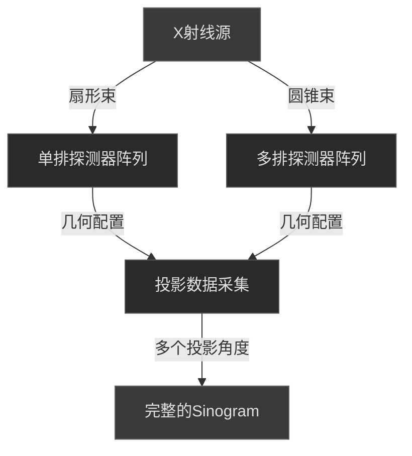
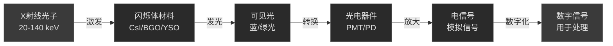
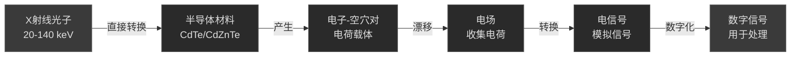
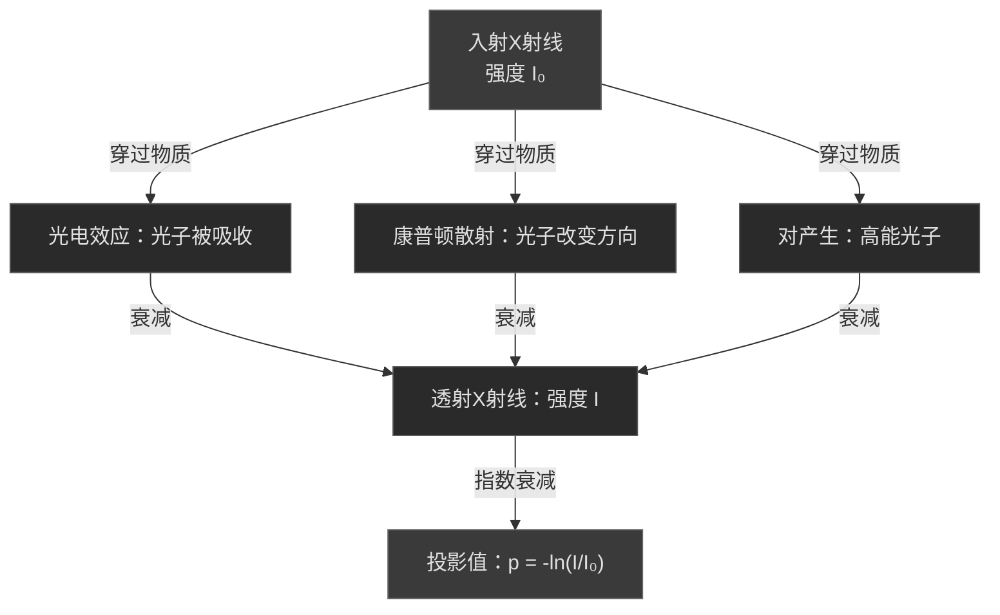
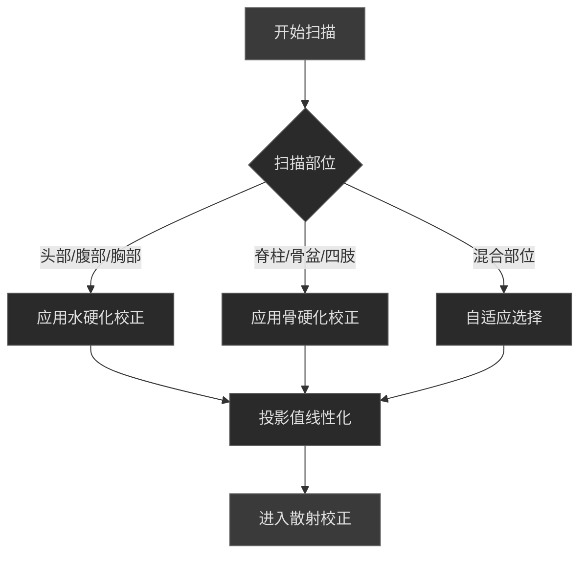

# 2.1 CT：从探测器信号到校正投影

> "在CT图像被重建之前，原始数据已经经历了一场复杂的物理和数学变换。理解这个过程，就是理解CT成像的灵魂。" —— 医学影像工程的智慧

想象这样一个场景：当放射科医生看到一张清晰的CT图像时，很少有人意识到这张图像背后的数据已经经历了多少次校正和处理。从X射线光子被探测器捕获的那一刻起，数据就开始了一场复杂的转换之旅——从物理信号到数字投影值，再到最终的重建图像。

本章将系统介绍这个过程的第一阶段：**从探测器信号到校正投影**。我们将深入探讨探测器如何捕获光子、光子如何转换为投影值，以及业内标准的校正流程。这些内容是理解CT重建的基础，也是优化图像质量的关键。

---

## 什么是预处理？

**预处理（Preprocessing）**是指在图像重建之前对原始数据进行的一系列处理步骤。这些步骤的目的是：

- **消除系统误差**：去除探测器和扫描系统引入的各种偏差
- **校正物理效应**：补偿X射线衰减、散射等物理现象
- **提高数据质量**：增强信噪比，减少伪影
- **为重建做准备**：将原始信号转换为适合重建算法的投影值

::: tip 💡 预处理的重要性
预处理的质量直接影响最终图像的质量。即使使用最先进的重建算法，如果预处理不当，也无法获得高质量的图像。这就是为什么现代CT扫描仪在预处理上投入了大量的工程和算法资源。
:::

---

## CT 探测器与光子采集

### 探测器的基本结构

现代CT扫描仪中的探测器是一个精密的电子设备阵列，其主要功能是捕获X射线光子并将其转换为可测量的电信号。

**探测器阵列的几何特性**：

- **排列方式**：探测器元素（Detector element）排成一维或二维阵列
- **几何配置**：
  - **扇形束几何（Fan-beam）**：单排探测器，X射线源和探测器形成扇形
  - **圆锥束几何（Cone-beam）**：多排探测器，X射线源和探测器形成圆锥
- **元素尺寸**：现代CT的探测器元素尺寸通常为 0.5-1.0 mm
- **排列密度**：高达 1000+ 个元素排成一行

*多排CT探测器阵列示意图：现代CT扫描仪采用多排探测器，可在一次旋转中同时采集多层数据*

::: info 💡 多排探测器的优势
多排探测器（Multi-slice detector）的出现是CT技术的重大进步。它允许在一次旋转中采集多层数据，大幅提高了扫描速度和时间分辨率。现代CT扫描仪通常配备 64-320 排探测器。
:::

---

### 闪烁体探测器（Scintillator Detectors）

**工作原理**：X射线光子激发闪烁体材料，产生可见光；光电倍增管（PMT）或光电二极管（PD）将可见光转换为电信号。

**光子转换过程**：

**常用闪烁体材料**：

- **CsI（碘化铯）**：高发光效率，广泛应用于医学成像
- **BGO（锗酸铋）**：高密度，适合高能X射线
- **YSO（钇硅酸盐）**：快速响应，适合时间分辨率要求高的应用

**性能指标**：

- **能量分辨率**：约 15-20%（相对较低）
- **时间分辨率**：约 100-200 ns
- **光学串话**：相邻探测器元素间的光学干扰

::: warning ⚠️ 闪烁体探测器的局限性
闪烁体探测器的主要缺点是能量分辨率较低，无法区分不同能量的光子。这限制了其在能量相关应用（如光子计数CT、双能CT）中的使用。此外，光学串话会导致空间分辨率的降低。
:::

---

### 直接转换探测器（Direct Conversion Detectors）

**工作原理**：X射线光子直接在半导体材料中产生电子-空穴对，无需中间的光转换过程。

**光子转换过程**：

**常用半导体材料**：

- **CdTe（碲化镉）**：高原子序数，高吸收效率
- **CdZnTe（碲化镉锌）**：改进的CdTe，更好的能量分辨率

**性能指标**：

- **能量分辨率**：约 5-10%（显著改善）
- **时间分辨率**：约 10-50 ns（更快）
- **光子计数能力**：能够计数单个光子并测量其能量

::: tip 💡 直接转换探测器的优势
直接转换探测器的高能量分辨率使其能够进行光子计数和能量分辨成像。这为双能CT、光子计数CT等先进技术奠定了基础。虽然成本较高，但其性能优势使其成为高端CT扫描仪的标准配置。
:::

---

### 光子计数探测器（Photon Counting Detectors）

**工作原理**：能够计数单个光子并测量其能量，是最新一代的探测器技术。

**关键特性**：

- **单光子计数**：每个光子都被单独计数和测量
- **能量分辨率**：最高可达 1-2%
- **无噪声放大**：相比传统探测器，噪声特性更优
- **能量分类**：可以根据光子能量进行分类采集

**临床应用前景**：

- 更低的辐射剂量
- 更高的对比分辨率
- 能量相关的诊断信息

::: info 💡 光子计数CT的发展现状
光子计数CT是当前CT技术的前沿方向。Siemens、GE等主要厂商已经推出了商用光子计数CT系统。这项技术有望在未来5-10年内成为高端CT的标准配置。
:::

---

### 探测器类型对比

| 特性             | 闪烁体探测器 | 直接转换探测器 | 光子计数探测器 |
| ---------------- | ------------ | -------------- | -------------- |
| **能量分辨率**   | 15-20%       | 5-10%          | 1-2%           |
| **时间分辨率**   | 100-200 ns   | 10-50 ns       | <10 ns         |
| **光子计数能力** | ❌ 否         | ⚠️ 部分         | ✅ 是           |
| **成本**         | 低           | 中             | 高             |
| **临床应用**     | 广泛         | 高端系统       | 前沿研究       |
| **主要优势**     | 成熟可靠     | 高分辨率       | 最优性能       |
| **主要劣势**     | 分辨率低     | 成本高         | 成本极高       |

---

## 光子计数到投影值的转换

### Lambert-Beer 定律的物理基础

CT成像的物理基础是X射线在物质中的衰减规律，这由**Lambert-Beer定律**描述。

**X射线的衰减机制**：

当X射线穿过物质时，光子会通过以下机制被吸收或散射：

- **光电效应**：光子被原子完全吸收，释放内层电子
- **康普顿散射**：光子与外层电子碰撞，改变方向和能量
- **对产生**：高能光子在原子核附近转化为电子-正电子对

**Lambert-Beer定律的数学表达**：

$$I = I_0 e^{-\mu x}$$

其中：
- $I_0$ 为入射X射线强度
- $I$ 为透射X射线强度
- $\mu$ 为线性衰减系数（单位：cm⁻¹）
- $x$ 为物质厚度（单位：cm）

**物理意义**：

- 衰减是指数衰减，而非线性衰减
- 线性衰减系数 $\mu$ 取决于物质的原子序数和X射线能量
- 高原子序数物质（如骨骼、金属）的 $\mu$ 值更大，衰减更强

::: warning ⚠️ 多能X射线的复杂性
实际的医学CT使用的是多能X射线（能谱范围通常为 20-140 keV）。不同能量的光子有不同的衰减系数，这导致射束硬化效应，需要特殊的校正方法。
:::

---

### 投影值的定义与计算

**投影值（Projection value）**是CT重建的基本数据单位，它表示X射线穿过物体后的衰减程度。

**从光子计数到投影值的转换**：

1. **光子计数**：探测器计数接收到的光子数 $N$
2. **参考计数**：在没有物体时的光子计数 $N_0$
3. **强度比**：$I/I_0 = N/N_0$
4. **投影值**：$p = -\ln(I/I_0) = -\ln(N/N_0)$

**投影值的数学表达**：

$$p = -\ln\left(\frac{N}{N_0}\right) = \int_{\text{ray}} \mu(x,y) \, ds$$

其中积分沿着X射线的传播路径进行。

**物理意义**：

- 投影值与物质的线性衰减系数成正比
- 投影值是一维的，表示沿着一条射线的衰减总和
- 多条射线的投影值组成投影数据（Sinogram）

::: tip 💡 投影值的重要性
投影值是连接物理测量和数学重建的桥梁。它将复杂的物理衰减过程转化为简单的数学量，使得重建算法可以直接处理。
:::

---

### Sinogram 的概念

**Sinogram（正弦图）**是所有投影值在二维平面上的排列，是CT重建的直接输入。

**Sinogram的坐标系统**：

- **横轴**：投影角度 $\theta$（0° 到 360°）
- **纵轴**：探测器位置 $t$（从 -D/2 到 +D/2，其中D为探测器宽度）
- **像素值**：投影值 $p(t, \theta)$

**Sinogram与原始图像的关系**：

Sinogram是原始图像的**Radon变换**。通过反Radon变换（或滤波反投影算法），可以从Sinogram重建出原始图像。

**Sinogram的特性**：

- 对于圆形物体，Sinogram呈现正弦波形（这是名称的来源）
- Sinogram的质量直接影响重建图像的质量
- 预处理的主要目标是生成高质量的Sinogram

*CT正弦图（Sinogram）与对应的重建图像：左侧为原始投影数据排列成的正弦图，右侧为重建后的CT图像*

::: info 💡 Sinogram是连接原始数据和重建的桥梁
理解Sinogram的概念对于理解CT重建至关重要。许多预处理步骤都是在Sinogram域进行的，目的是消除各种伪影和误差。
:::

---

## 业内常用的校正流程

### 校正流程概述

从原始探测器信号到校正投影值，需要经过一系列标准化的校正步骤。这些步骤的顺序很重要，因为某些校正依赖于前面步骤的结果。

**完整的校正流程**：

::: tip 💡 校正顺序的重要性
校正步骤的顺序不是任意的。通常，系统级的校正（如暗电流、增益）应该先进行，然后是物理效应的校正（如射束硬化、散射）。错误的顺序可能导致校正效果不佳甚至引入新的伪影。
:::

---

### 暗电流校正（Dark Current Correction）

**原理**：探测器在没有X射线照射时仍然会产生背景信号，这称为暗电流。暗电流是由热噪声、漏电流和电子学噪声组成的系统性背景信号，必须在后续校正之前被消除。

**暗电流的来源**：

- **热噪声**：探测器元素的热运动产生的随机信号，与温度成指数关系
- **漏电流**：半导体材料的漏电流，与偏置电压和温度有关
- **电子噪声**：读出电路的噪声，包括放大器噪声和模数转换噪声

**详细的校正算法**：

**第一步：采集暗电流参考数据**
- 关闭X射线源
- 保持探测器偏置电压和读出参数与实际扫描相同
- 采集 $N_{\text{dark}}$ 帧数据（通常 10-100 帧）
- 每帧采集所有探测器元素的信号

**第二步：计算暗电流平均值**
$$I_{\text{dark}, i} = \frac{1}{N_{\text{dark}}} \sum_{k=1}^{N_{\text{dark}}} I_{\text{dark}, i}^{(k)}$$

其中 $i$ 为探测器元素索引，$k$ 为帧索引。

**第三步：计算暗电流标准差（用于质量控制）**
$$\sigma_{\text{dark}, i} = \sqrt{\frac{1}{N_{\text{dark}}} \sum_{k=1}^{N_{\text{dark}}} (I_{\text{dark}, i}^{(k)} - I_{\text{dark}, i})^2}$$

**第四步：应用校正**
$$I_{\text{corrected}, i} = I_{\text{measured}, i} - I_{\text{dark}, i}$$

对所有探测器元素和所有投影角度应用此校正。

**质量控制检查**：
- 暗电流值应该均匀分布，标准差 $\sigma_{\text{dark}, i}$ 应该小于 1% 的平均值
- 如果某个探测器元素的暗电流异常高，可能表示该元素故障
- 暗电流随温度变化，温度每升高 10°C，暗电流约增加 2 倍

**实际应用**：

- **扫描前校正**：在每次扫描前采集新的暗电流参考数据
- **温度补偿**：对于长时间扫描，可能需要定期更新暗电流参考
- **实时监测**：某些高端系统支持在扫描过程中实时监测暗电流变化

::: warning ⚠️ 暗电流校正的重要性
暗电流校正必须是第一步校正，因为后续的增益校正和投影值计算都依赖于准确的暗电流消除。不完全的暗电流校正会导致系统性的CT值偏差。
:::

---

### 增益校正（Gain Correction）

**原理**：不同探测器元素的灵敏度存在差异，这种不均匀性来自制造工艺偏差、电子学差异和老化效应。增益校正通过建立每个探测器元素的灵敏度系数，使所有元素的响应均匀化。

**增益不均匀性的来源**：

- **制造工艺偏差**：探测器元素的制造过程中的微小差异（±5-10%）
- **电子学差异**：读出电路的增益差异，包括放大器增益和偏置
- **老化效应**：长期使用导致的性能衰退，特别是在高计数率下
- **温度漂移**：探测器温度变化导致的灵敏度变化

**详细的校正算法**：

**第一步：采集平场参考数据**
- 在均匀X射线照射下采集数据（无被扫描物体）
- 使用与实际扫描相同的X射线参数（kVp、mA）
- 采集 $N_{\text{flat}}$ 帧数据（通常 10-100 帧）
- 确保计数率足够高（>10⁶ 计数/秒）以获得良好的统计

**第二步：计算平场平均值**
$$I_{\text{flat}, i} = \frac{1}{N_{\text{flat}}} \sum_{k=1}^{N_{\text{flat}}} I_{\text{flat}, i}^{(k)}$$

**第三步：计算参考强度**
$$I_{\text{ref}} = \frac{1}{N_{\text{det}}} \sum_{i=1}^{N_{\text{det}}} I_{\text{flat}, i}$$

其中 $N_{\text{det}}$ 为探测器元素总数。

**第四步：计算增益系数**
$$G_i = \frac{I_{\text{ref}}}{I_{\text{flat}, i}}$$

这个系数表示第 $i$ 个探测器元素相对于平均灵敏度的偏差。

**第五步：应用校正**
$$I_{\text{corrected}, i} = (I_{\text{measured}, i} - I_{\text{dark}, i}) \times G_i$$

注意：增益校正必须在暗电流校正之后进行。

**质量控制检查**：
- 增益系数应该在 0.9-1.1 范围内（±10%）
- 如果某个元素的增益系数偏离过大（>±20%），可能表示该元素故障
- 增益系数的标准差应该 < 5%

**实际应用参数**：

- **校正频率**：每周或每月进行一次完整的增益校准
- **快速校准**：某些系统支持快速增益校准（<1 分钟）
- **动态校正**：高端系统可在扫描过程中实时调整增益系数

::: tip 💡 增益校正的重要性
增益校正直接影响投影数据的均匀性。不完全的增益校正会导致环形伪影和条纹伪影。现代CT扫描仪通常在增益校正后进行质量检查，确保所有探测器元素的响应在可接受范围内。
:::

---

### 空气校正（Air Calibration）

**原理**：在没有被扫描物体时采集参考数据，用于后续的投影值计算。

**空气校正的目的**：

- 获取参考强度 $I_0$，用于计算投影值 $p = -\ln(I/I_0)$
- 消除X射线源强度的波动
- 建立投影值的基准

**空气校正的采集条件**：

- 扫描视野内没有任何物体
- X射线参数（kVp、mA）与实际扫描相同
- 采集足够多的投影以获得稳定的平均值

**实际应用**：

- 空air校正通常在每次扫描前进行
- 某些系统支持连续空气校正
- 空气校正的稳定性直接影响投影值的准确性

::: warning ⚠️ 空气校正的稳定性要求
空气校正数据必须稳定可靠。如果空气校正不当，会导致投影值的系统偏差，进而影响重建图像的CT值准确性。
:::

---

### 射束硬化校正（Beam Hardening Correction）

**原理**：X射线是多能的，低能光子被优先吸收，导致射线束的平均能量增加（"硬化"）。这种能谱改变导致有效衰减系数随着物质厚度非线性变化，违反了Lambert-Beer定律的线性假设。

**射束硬化的物理过程**：

1. **初始能谱**：X射线源产生的多能谱（通常为 20-140 keV）
2. **选择性吸收**：低能光子被优先吸收，高能光子优先透射
3. **能谱改变**：透射X射线的平均能量增加，能谱变"硬"
4. **衰减系数改变**：有效衰减系数 $\mu_{\text{eff}}$ 随着能谱改变而改变，不再是常数

*蓝色能谱为入射X-射线束的能谱，红色能谱为在穿过厚度1厘米的铝块后的能谱*

*穿过不同厚度的任意物体，投影值与路径长度关系的示意图*

**射束硬化的临床表现**：

- **杯状伪影（Cupping artifact）**：均匀物体的中心CT值偏低，边缘偏高，形成"杯子"形状
- **暗带伪影（Dark band artifact）**：两个高密度物体（如骨骼）之间出现暗带
- **条纹伪影（Streaking artifact）**：从高密度物体向外辐射的条纹

**业内常用的两种校正方法**：

#### 1. 水硬化校正（Water Beam Hardening Correction）

**适用场景**：当扫描对象主要由水或水样物质组成时（如软组织、脑脊液）

**物理原理**：

水是人体的主要成分（约 60-70%）。在水中，X射线的衰减主要由光电效应和康普顿散射决定。通过建立单一材料（水）的能谱-衰减关系，可以对多能X射线进行线性化处理。

**校正方法**：

1. **建立水的衰减曲线**：
   - 对不同厚度的水进行扫描
   - 测量投影值 $p_{\text{measured}}$ 与水厚度 $x$ 的关系
   - 由于多能效应，关系为非线性：$p_{\text{measured}} = f(x)$（非线性）

2. **多项式拟合**：
   $$p_{\text{measured}} = a_0 + a_1 x + a_2 x^2 + a_3 x^3 + \ldots$$

3. **反演得到线性化函数**：
   $$x = g(p_{\text{measured}})$$

4. **应用校正**：
   $$p_{\text{corrected}} = \mu_{\text{water}} \cdot g(p_{\text{measured}})$$

   其中 $\mu_{\text{water}}$ 为水的线性衰减系数。

**实际应用参数**：

- **校正多项式阶数**：通常为 2-3 阶
- **校正系数**：根据X射线管电压（kVp）和滤波器类型确定
- **更新频率**：每周或每月进行一次校准

::: info 💡 水硬化校正的优势
水硬化校正是最简单、最稳定的方法，因为水的成分均匀、衰减特性明确。它适用于大多数临床CT扫描，特别是头部和腹部成像。
:::

#### 2. 骨硬化校正（Bone Beam Hardening Correction）

**适用场景**：当扫描对象包含大量骨骼或高密度物质时（如骨盆、脊柱、四肢）

**物理原理**：

骨骼的X射线衰减系数与水不同，主要由于骨骼含有钙和磷等高原子序数元素。在骨骼中，低能光子的衰减更强，导致能谱硬化效应更明显。单纯的水硬化校正会导致骨骼区域的CT值偏低。

**校正方法**：

1. **建立两材料模型**：
   - 假设扫描对象由水和骨两种材料组成
   - 对水和骨进行分别扫描，建立各自的衰减曲线

*骨硬化假设示意图*

2. **材料分解**：
   对于混合材料，投影值为：
   $$p_{\text{measured}} = \int_{\text{ray}} [\mu_{\text{water}}(E) \cdot f_{\text{water}} + \mu_{\text{bone}}(E) \cdot f_{\text{bone}}] \, dE$$

   其中 $f_{\text{water}}$ 和 $f_{\text{bone}}$ 为沿射线的水和骨的体积分数。

3. **迭代校正**：
   - 初始假设：全部为水
   - 重建图像，识别骨骼区域
   - 根据骨骼区域应用骨硬化校正
   - 重复直到收敛

4. **应用校正**：
   $$p_{\text{corrected}} = p_{\text{measured}} - \Delta p_{\text{bone}}$$

   其中 $\Delta p_{\text{bone}}$ 为骨硬化导致的投影值偏差。

**实际应用参数**：

- **骨密度假设**：通常假设为 1.85 g/cm³（皮质骨）
- **校正强度**：可根据扫描部位调整（头部 0.5-1.0，脊柱 1.0-1.5）
- **计算复杂度**：比水硬化校正高 3-5 倍

::: warning ⚠️ 骨硬化校正的挑战
骨硬化校正需要准确识别骨骼区域，这在低对比度或有金属植入物的情况下困难。过度校正可能导致骨骼区域CT值偏高，甚至引入新的伪影。
:::

#### 水硬化 vs 骨硬化校正对比

| 特性                 | 水硬化校正       | 骨硬化校正       |
| -------------------- | ---------------- | ---------------- |
| **适用场景**         | 软组织为主       | 骨骼为主         |
| **计算复杂度**       | 低               | 高               |
| **校正精度**         | 中等             | 高               |
| **软组织CT值准确性** | 高               | 中等             |
| **骨骼CT值准确性**   | 中等             | 高               |
| **计算时间**         | <100 ms          | 500-1000 ms      |
| **常见应用**         | 头部、腹部、胸部 | 脊柱、骨盆、四肢 |
| **临床推荐**         | 标准方案         | 特殊需求         |

**校正流程选择**：

::: tip 💡 射束硬化校正的重要性
射束硬化是CT成像中最常见的伪影之一。有效的射束硬化校正对于获得准确的CT值和高质量的图像至关重要。现代CT扫描仪通常根据扫描部位自动选择合适的校正方法。
:::

---

### 散射校正（Scatter Correction）

**原理**：X射线在患者体内散射产生的信号会被探测器误认为是直接透射光子，导致投影值偏高。这种散射信号会降低图像对比度、增加噪声，并产生各种伪影。

**散射的物理过程**：

1. **初始光子**：直接从X射线源发出的光子
2. **康普顿散射**：光子与患者体内的电子碰撞，改变方向和能量
3. **散射光子到达探测器**：散射光子从各个方向到达探测器
4. **虚假信号**：散射光子被计数为直接透射光子

**散射对投影值的影响**：

- **投影值偏高**：$p_{\text{measured}} = p_{\text{true}} + p_{\text{scatter}}$
- **对比度降低**：散射增加了背景信号，降低了信噪比（SNR）
- **CT值偏差**：重建图像的CT值不准确，特别是在低密度区域
- **伪影产生**：散射不均匀导致条纹伪影和杯状伪影

**散射校正的方法**：

#### 硬件方法：反散射栅（Anti-scatter Grid）

**原理**：使用铅制的细栅吸收散射光子，只允许直接光子通过

**结构**：
- 铅条间距：通常 1-2 mm
- 铅条厚度：0.1-0.2 mm
- 栅比（Grid Ratio）：通常 12:1 到 16:1

**性能指标**：
- **散射消除率**：60-80%
- **一次光子透射率**：70-85%
- **栅因子（Grid Factor）**：1.2-1.5（需要增加曝光以补偿吸收）

**优点**：
- 简单可靠
- 实时有效
- 不需要复杂的算法

**缺点**：
- 增加患者剂量（栅因子）
- 可能产生栅伪影（Grid line artifacts）
- 对于大视野成像效果有限

#### 软件方法：基于测量的散射校正

**原理**：通过测量或估计散射分布，从投影值中减去散射贡献

**算法步骤**：

**第一步：散射分布估计**
- 方法 1：使用小孔径准直器（Collimator）测量散射分布
- 方法 2：基于患者轮廓和X射线能谱进行蒙特卡洛模拟
- 方法 3：使用机器学习模型预测散射分布

**第二步：散射投影值计算**
$$p_{\text{scatter}}(\theta) = f(\text{patient geometry}, \text{X-ray spectrum}, \theta)$$

其中 $\theta$ 为投影角度。

**第三步：散射校正**
$$p_{\text{corrected}}(\theta) = p_{\text{measured}}(\theta) - p_{\text{scatter}}(\theta)$$

**第四步：质量控制**
- 检查校正后的投影值是否在合理范围内
- 如果校正过度，可能导致负的投影值

**算法复杂度**：
- 蒙特卡洛模拟：1-10 秒
- 机器学习预测：<100 ms

#### 迭代方法：基于重建的散射校正

**原理**：通过迭代重建和散射估计，逐步改善散射校正

**算法步骤**：

**初始化**：$k = 0$，$p_{\text{corrected}}^{(0)} = p_{\text{measured}}$

**迭代循环**：

1. **重建图像**：$I^{(k)} = \text{Reconstruct}(p_{\text{corrected}}^{(k)})$

2. **前向投影**：$p_{\text{forward}}^{(k)} = \text{ForwardProject}(I^{(k)})$

3. **散射估计**：$p_{\text{scatter}}^{(k)} = p_{\text{measured}} - p_{\text{forward}}^{(k)}$

4. **散射校正**：$p_{\text{corrected}}^{(k+1)} = p_{\text{measured}} - \alpha \cdot p_{\text{scatter}}^{(k)}$

   其中 $\alpha$ 为校正因子（通常 0.5-1.0）

5. **收敛检查**：如果 $||p_{\text{corrected}}^{(k+1)} - p_{\text{corrected}}^{(k)}|| < \epsilon$，停止；否则 $k = k+1$，回到步骤 1

**迭代次数**：通常 2-5 次迭代

**算法复杂度**：$O(N_{\text{iter}} \times T_{\text{recon}})$，通常 5-20 秒

**实际应用**：

- **医学CT**：主要使用反散射栅 + 软件校正的组合
- **圆锥束CT**：由于大视野，散射问题更严重，通常需要更复杂的校正
- **低剂量CT**：散射相对信号比例更高，需要更精细的校正

**散射校正方法对比**：

| 方法             | 散射消除率 | 计算时间    | 复杂度 | 应用场景         |
| ---------------- | ---------- | ----------- | ------ | ---------------- |
| **反散射栅**     | 60-80%     | 0 ms        | 低     | 标准医学CT       |
| **基于测量**     | 70-90%     | 100-1000 ms | 中     | 高精度应用       |
| **蒙特卡洛模拟** | 80-95%     | 1-10 s      | 高     | 研究和特殊应用   |
| **迭代方法**     | 85-95%     | 5-20 s      | 高     | 低剂量和特殊应用 |

::: warning ⚠️ 散射校正的挑战
散射校正是CT预处理中最具挑战性的任务之一。散射的分布复杂，受患者体型、扫描参数等多种因素影响。过度校正可能导致图像质量下降，甚至引入新的伪影。
:::

---

### 环形伪影校正（Ring Artifact Correction）

**原理**：探测器元素的故障或校准误差会导致在重建图像中出现以扫描中心为圆心的同心圆环。这是因为每个探测器元素在扫描过程中旋转一周，其故障会在重建图像中形成圆环。

**环形伪影的来源**：

- **探测器故障**：某个探测器元素响应异常或完全失效
- **校准误差**：增益或暗电流校准不准确，导致该元素的信号偏差
- **电子学问题**：读出电路的故障或噪声过高
- **老化不均匀**：某些探测器元素老化速度快于其他元素

*CT环形伪影：由探测器元素故障或校准误差导致的同心圆环伪影，以扫描中心为圆心*

**环形伪影的特征**：

- **位置固定**：以扫描中心为圆心的同心圆环，在所有层面上位置相同
- **密度表现**：通常表现为高密度环（故障元素信号过高）或低密度环（故障元素信号过低）
- **宽度**：通常为 1-3 个像素宽

**详细的校正算法**：

#### 投影域校正（Sinogram Domain Correction）

**优势**：直接在原始数据上进行，效果最佳

**算法步骤**：

**第一步：异常值检测**
- 对于每个探测器元素 $i$，计算所有投影角度的投影值序列：$\{p_i(\theta_1), p_i(\theta_2), \ldots, p_i(\theta_N)\}$
- 计算该序列的中值（Median）：$p_i^{\text{median}}$
- 计算偏差：$\Delta p_i(\theta) = p_i(\theta) - p_i^{\text{median}}$
- 如果 $|\Delta p_i(\theta)| > T \cdot \sigma_i$（其中 $T$ 为阈值，通常 3-5，$\sigma_i$ 为标准差），则标记为异常

**第二步：异常值修复**
- 对于检测到的异常值，使用相邻探测器元素的数据进行插值：
$$p_i^{\text{corrected}}(\theta) = \frac{p_{i-1}(\theta) + p_{i+1}(\theta)}{2}$$

- 或使用更复杂的加权插值：
$$p_i^{\text{corrected}}(\theta) = w_1 \cdot p_{i-1}(\theta) + w_2 \cdot p_{i+1}(\theta)$$

其中权重 $w_1, w_2$ 根据相邻元素的可靠性确定。

**第三步：平滑处理**
- 对修复后的数据进行轻微平滑，以避免引入新的伪影
- 使用中值滤波或高斯滤波

**算法复杂度**：$O(N_{\text{det}} \times N_{\text{angle}})$，通常 <100 ms

#### 图像域校正（Image Domain Correction）

**优势**：可以处理投影域无法检测的复杂情况

**算法步骤**：

**第一步：环形伪影检测**
- 在重建图像中，沿径向方向计算强度变化
- 检测周期性的强度波动（对应于环形伪影）

**第二步：环形伪影分离**
- 使用傅里叶变换或小波变换分离环形伪影
- 环形伪影主要集中在低频分量

**第三步：伪影消除**
- 从图像中减去分离出的环形伪影
- 或使用非局部均值滤波等高级方法

**算法复杂度**：$O(N_x \times N_y \times \log(N_x))$，通常 500-1000 ms

**实际应用**：

- **预防性校准**：定期进行增益和暗电流校准，预防环形伪影的产生
- **自动检测**：现代CT扫描仪配备自动环形伪影检测系统
- **实时修复**：某些系统支持在扫描过程中实时检测和修复
- **离线处理**：对于已有的数据，可以进行离线环形伪影校正

**质量控制指标**：

- **环形伪影强度**：应该 < 5 HU（Hounsfield Units）
- **检测灵敏度**：应该能检测到 > 10% 的探测器故障
- **修复准确性**：修复后的图像质量应该与正常扫描相当

::: warning ⚠️ 环形伪影校正的局限性
虽然环形伪影校正可以显著改善图像质量，但无法完全消除所有伪影。对于严重的探测器故障（如多个相邻元素失效），可能需要更复杂的算法或硬件维修。
:::

---

### 其他校正步骤

根据具体应用场景，可能还需要进行其他校正：

**金属伪影减除（MAR）**：
- 在患者体内有金属植入物时进行
- 通常在投影域进行
- 使用插值或迭代方法

**运动校正**：
- 在患者运动时进行
- 使用运动估计和补偿算法
- 对心脏和腹部成像特别重要

**剂量优化相关的校正**：
- 低剂量扫描的噪声校正
- 自适应滤波
- 迭代重建前的预处理

### 完整的数据流

从原始信号到校正投影值的完整数据流可以总结如下：

::: tip 💡 预处理的重要性
预处理是CT成像中最容易被忽视但最重要的环节。高质量的预处理是获得高质量重建图像的必要条件。投入时间理解和优化预处理流程，会在长期内获得显著的收益。
:::

---

::: info 💡 下一步学习

经过完整的预处理，原始探测器信号已经被转换为校正的投影值（Sinogram）。这些投影值现在可以进入**重建阶段**。

下一章（2.2）将介绍MRI的k-空间数据预处理，展示不同成像模态的预处理流程如何各具特色。而第三章将深入介绍CT重建算法，说明如何从Sinogram重建出最终的CT图像。
:::

---

[1] BAUR M, UHLMANN N, PÖSCHEL T, et al., 2019. Correction of beam hardening in x-ray radiograms[J]. Review of Scientific Instruments, 90(2): 025108. DOI: 10.1063/1.5080540.

## 📎 图片引用来源

- 多排CT探测器阵列：[Wikimedia Commons - Matrix array multi-slice CT detector](https://commons.wikimedia.org/wiki/File:Matrix_array_multi-slice_CT_detector.jpg)，Public Domain
- CT正弦图示例：[Wikimedia Commons - Sinogram and sample image of CT](https://commons.wikimedia.org/wiki/File:Sinogram_and_sample_image_of_computed_tomography_of_the_jaw.jpg)，CC BY 2.5
- CT环形伪影示例：[Wikimedia Commons - CT ring artifacts](https://commons.wikimedia.org/wiki/File:CT_ring_artifacts_on_an_abdomen_scan.jpg)，CC BY 4.0