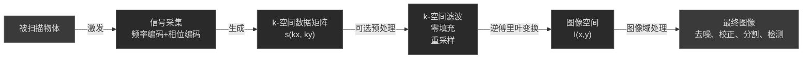
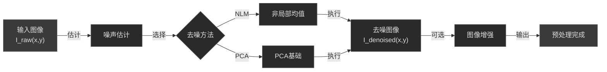
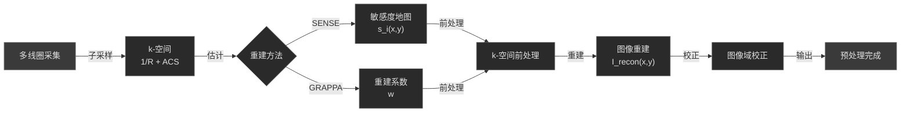
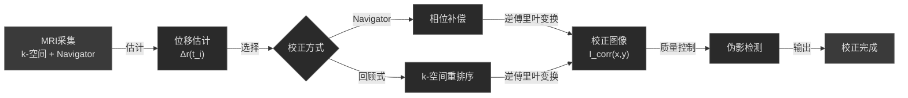

# 2.2 MRI：k空间数据预处理

> "MRI采集的不是图像，而是频域的'音乐'。理解k-空间，就是学会'听'这首音乐的语言。" —— 医学影像信号处理的智慧

想象这样一个场景：当放射科医生看到一张清晰的MRI图像时，很少有人意识到这张图像背后的数据采集过程有多么复杂。从核磁共振信号被接收线圈捕获的那一刻起，数据就开始了一场复杂的频域之旅——从k-空间的原始采样，经过噪声估计、并行成像重建、运动校正，最后才通过傅里叶变换转化为我们看到的图像。

本章将系统介绍MRI预处理的完整流程。与CT预处理不同，MRI预处理的核心在于**k-空间域的处理**。我们将深入探讨k-空间的物理意义、噪声特性、并行成像的重建机制，以及如何通过科学的预处理提高图像质量。这些内容是理解MRI成像的基础，也是优化图像质量的关键。

## 🔬 k 空间基础概念（频域表示）

### 1.1 k-空间

在k‑space（以下简称k-空间）这一概念之前，在MRI（磁共振成像）中我们习惯于直接理解图像是基于体素在空间位置 $(x, y, z)$ 上的信号强度。但实际上，MR采集的是一种频域\空间频率域的数据，也就是 k-空间，其核心原因包括：

* 在 MRI 中，通过施加梯度磁场，使得被激发的核磁共振信号带有空间编码。因此，接收到的信号本质上是物体在不同空间频率（取决于梯度强度与时间）的成分。
* 从信号处理\傅里叶分析角度来看，一个空间分布 $I(x,y)$ 可以通过傅里叶变换表示为一系列不同频率分量的叠加，k-空间恰好就是这些空间频率分量在二维或三维域上的“地图”。
* 实际上，MRI 所采集的原始数据矩阵即为 k-空间数据（通常按行按列储存，对应频率编码方向 $k_x$ 和相位编码方向 $k_y$ ）。然后通过逆傅里叶变换得到最终图像。

::: tip 💡 通俗理解：k-空间与音乐频谱的类比
如果把一张照片看作"物体"，那么 k-空间就类似"声音的频谱"——比如你听一段音乐，把它做傅里叶变换，得到不同频率的强度分布。类似地，物体的空间结构可被拆成多种"空间频率"成分。中心频率成分对应图像中的大块结构、整体灰度；高频成分对应物体的边缘、细节。我们通过梯度编码提取这些"频率"成分，储存在k-空间，再做逆变换复原图像。
:::

*MRI k-空间数据可视化：k-空间中心区域包含图像的低频信息（整体对比度），外围区域包含高频信息（边缘细节）*

---

### 1.2 数学原理

### 1.2.1 MRI 信号方程

在经典MRI物理／信号处理课程中，假设二维情形（ $x,y$ 平面），且假设激发后的横向磁化 $M_o(x,y)$，则沿梯度编码方向接收的信号 $s(t)$ 可近似表示为：

$$
s(t) = \iint_{x,y} M_0(x,y) e^{-i\Delta\omega(x,y)t}dxdy
$$

其中 $\Delta\omega(x,y) = \gamma (G_x,x + G_y,y)$ ， $γ$  为回旋比， $G_x、G_y$ 为频率编码及相位编码梯度强度。
令

$$
k_x(t) = \frac{\gamma G_xt}{2\pi}, \quad k_y(t) = \frac{\gamma G_yt}{2\pi}
$$

则上述可写为

$$
s\big(k_x(t), k_y(t)\big)
= \iint M_0(x,y)e^{-i 2\pi \big(k_x(t)x + k_y(t)y\big)} dxdy
$$

即

$$
s(\mathbf{k}) = \iint I(x,y)e^{-i2\pi(\vec{k}\cdot\vec{r})}d\mathbf{r}
$$

其中 
- $M_0(x,y)$ ：目标物体的空间磁化分布（图像）
- $(k_x(t), k_y(t))$ ：采样时刻 (t) 的 k-space 坐标
- 指数项的相位： $-i 2\pi (\vec{k}\cdot\vec{r})$
- $I(x,y) = M_0(x,y)$ 可视为物体图像在空间域 $r = (x,y)$ 下的分布，这个式子正是二维傅里叶变换。

### 1.2.2 傅里叶逆变换还原图像

知道 $s(k_x,k_y)$（即 k-空间上每个点的采样值）后，通过二维逆傅里叶变换即可恢复图像 $I(x,y)$ ：

$$
I(x,y) = \iint s(k_x, k_y)e^{+i2\pi\big(k_x(t)x + k_y(t)y\big)}dk_xdk_y
$$

这里假设连续采样且无限积分，实际MRI是离散采样（矩阵 $K×L$ ），逆变换变为离散傅里叶逆变换（IDFT），这便是k-空间 → 图像空间的关键数学关系。 

### 1.2.3 k-空间的几何意义与空间频率

在 k-空间中：

* 位置 (kₓ, k_y) 表示采样的 **空间频率** 成分，对应图像中 “在 x 方向\y 方向上变化快\变慢” 的结构。低频 $k≈0附近$ 表示图像中灰度\对比度的大尺度结构；高频 (k 较远离中心) 表示边缘、细节、小结构。
* k-空间中心处的数据决定图像整体信号强度\对比；外围的数据决定图像中细节与边缘定义。举例：如果只保留中心一小块 k-空间，图像会看起来模糊但大致结构可见；如果只保留外围，则可能看见边缘但整体对比弱。 
* k-空间与图像空间（x,y）互为傅里叶变换对。k-空间格点间距 Δk 与图像视野 FOV 有反比关系；k-空间覆盖范围越大，图像空间的分辨率越高；k-空间采样不足、或间距过大，会导致别名（aliasing）、分辨率下降等问题。 

**通俗理解**
想象拍照，若你只记录照片的大致颜色分布比如每 10×10 像素取一个平均色，那么照片会模糊；如果你还记录每一像素甚至更多变化（高频变化），照片就能清晰地显示细节。同理：k-空间中心≈照片的大致颜色\灰度；外围≈边缘、细节。

### 1.3 k-空间在实际MRI采集中的体现

### 1.3.1 频率编码与相位编码

在二维扫描中，典型流程为：

* 先在一个方向（通常 x 方向）施加频率编码梯度在接，收信号期间，$x$ 方向的梯度使得不同 $x$ 位置的角频率 $ω$ 不同，因此接收到的信号可以按频域解码。
* 在另一个方向（通常 y 方向）施加相位编码梯度，在每次不同的相位编码步结束后，采集一行数据（即一条 $k_x$ 轴的采样）；然后改变 $G_y$ （或其持续时间）做下一行。
* 因而，最终建立一个二维数据矩阵：行对应不同 $k_y$ （相位编码步数），列对应不同 $k_x$（频率编码采样点）。这个矩阵即为k-空间。

### 1.3.2 k-空间填充与采样轨迹

不同MRI序列采用不同的 k-空间采样轨迹。常见有：

①规则 Cartesian（笛卡尔）网格：按行按列逐步采集，每一相位编码步对应一 $k_x$ 采样行。

②非笛卡尔轨迹：如径向、螺旋、星状等，用于加速或特定成像目的。

③在快速成像中，会采用EPI、单shot EPI等，一次激发后可填充多行k-空间。

### 1.3.3 k-空间与图像重建

当k-空间采集完毕或部分采集后，即通过逆傅里叶变换 (通常利用快速傅里叶变换 FFT) 将 $s(k_x,k_y)$ 转为 $I(x,y)$ ，在多线圈系统中，还要做线圈组合、敏感度校正等

### 1.3.4 k-空间缺陷/采样限制影响

实际中，k-空间常有如下问题：

①采样不够、欠采样：若不满足Nyquist采样定理，会出现图像伪影。

②k-空间采样间距与图像 FOV： $Δk$ 与 FOV 反比，若 Δk 增大，则 FOV 缩小，可能产生 wrap-around\折叠伪影。

③k-空间截断（只采中央部分或外围部分较少）：可能产生模糊（失细节）或Gibbs环伪影。

④采样轨迹与梯度\系统限制：比如梯度不完美、延迟、非理想磁场，会导致k-空间数据畸变从而影响重建。

**通俗理解**
就是如果你拍摄一幅风景照，但相机只记录整体大致色块，而忽略了细节比如草丛的叶片纹理，那么照片会显得模糊，这就像 k-空间只采中央部分，反之，如果只记录草叶纹理而忽略整体色块，照片则可能缺乏整体对比。

### 1.4 面向AI辅助诊断与图像处理

对于使用AI辅助诊断（例如肿瘤识别）或从事医学影像人工智能开发的人员而言，理解k-空间预处理的意义主要体现在以下几点：

①图像质量基础：图像中出现的模糊、边缘不清、伪影（Gibbs、折叠）往往根源于 k-空间采样、填充、补偿不当，若预处理阶段忽视 k-空间问题，后续的分割\检测模型输入即可能受坏图像影响，大模型性能下降。

②重建与重采样策略：若输入数据为重建后图像（DICOM）而你希望从 k-空间层面改进如自定义重建、部分补采样、校正缺陷，那么理解 k-空间采样轨迹、信号模型、重建算法对大模型前处理管线设计尤为关键。

③噪声与伪影来源：很多伪影（运动、梯度非线性、线圈敏感度变化）在 k-空间层面表现为异常频率成分或采样失真。识别这些可通过在 k-空间域或频域做校正、更好去噪，提高后续大模型训练数据质量。

④下游AI任务兼容性：例如你做肝脏肿瘤检测，若原始 k-空间采样策略发生变化如加速采样、并行成像、部分 Fourier、非笛卡尔轨迹，重建后图像可能含有不同噪声模式\结构特征，大模型训练时需考虑这些差异。

因此，在k-空间数据预处理环节，对AI型医学影像系统来说不仅要做图像域（如均一化、分割、增强）处理，也建议考虑 k-空间层面的校正与优化，以提高图像质量、减少伪影、提升大模型可靠性。

### 1.5 k-空间数据流程图

下图为 k-空间基础的数据流与处理流程：

每一步的关键说明：

①“激发／信号采集”阶段：梯度施加、核磁共振信号检测、按相位编码步数收集 $k_y$ 行数据。

②“k-空间数据预处理”阶段：可能包含零填充、滤窗、非笛卡尔轨迹重采样、校正梯度延迟或非线性、线圈敏感度校正等。

③“逆傅里叶变换”阶段：将频域数据变回来空间域，以生成可视图像。

④“图像域进一步处理”阶段：AI模型常在这一层做分割、检测，但如果前面 k-空间采样\重建有问题，图像输入将受影响。

### 1.6 总结

本小节从k-空间的物理、数学原理出发，解释了为何MRI采集的是频域数据、k-空间与图像空间的傅里叶关系、k-空间采样策略如何影响最终图像质量，并从AI辅助诊断、医学影像AI研究者的视角来理解这一环节的重要性，接下来我们将进入第二节：噪声估计与去噪。

## 📊 噪声估计与去噪

### 2.1 噪声在 MRI 图像中的来源与影响

### 2.1.1 噪声来源

在 MRI 成像过程中，会有多个噪声\误差来源，其包括但不限于：

* 热噪声来自接收线圈、电路。
* 核磁共振信号本身的随机波动（磁化率差、T2*衰减、化学位移等变化）。
* 梯度不完全\磁场不均匀\涡流（eddy currents）引起的编码误差。
* 多线圈成像中不同通道敏感度变化、信号叠加、重建时噪声放大。
* 运动伪影（后续第四节更详述）也会表现为噪声\失真。

噪声会降低图像信噪比 (SNR)、模糊病灶边界、增加伪影、降低后续大模型分割\检测的准确性。

### 2.1.2 噪声统计特性

对于MRI图像（幅度图像），如果重建方式是合并多通道线圈信号，噪声往往呈Rician分布（单线圈）或更一般的 $nc-χ$（非中心卡方）分布，多通道并行重建时，噪声分布空间可能非平稳；对于k-空间采样\重建误差、滤波、零填充等预处理操作，也会改变噪声的均值、协方差结构；对于AI应用而言，如果忽略噪声模型，模型可能学习“噪声特征”而非“病灶特征”，导致泛化能力差。

### 2.2 去噪的基本思路与数学原理

常见图像域去噪方法包括基于滤波如均值、中值、高斯、基于变换域（小波、PCA）、基于非局部自相似（NLM）等，以下重点介绍在MRI图像处理中较为常用的两类： NLM (Non-Local Means) 与PCA-based去噪。

### 2.2.1 非局部均值 (NLM) 去噪

**原理**
NLM的核心思想：图像中的相似小块（patch）不仅限于局部邻域，而可遍及整幅图。一个像素的噪声抑制可以利用它与图像中其他具有类似结构的小块之间的相似性加权平均，这样可更好保留边缘、结构，而不是简单模糊。其通用形式为：

$$
\tilde I(p) = \frac{1}{C(p)} \sum_{q \in \mathcal{I}} w(p,q)I(q)
$$

其中：

* $p$ 是目标像素位置；
* $\mathcal{I}$ 表示全图或搜索窗口内的所有位置 $q$ ；
* $w(p,q)$ 是权重，取决于 $patch(p)$ 与 $patch(q)$ 的相似度；
* $C(p) = \sum_{q} w(p,q)$ 是归一化常数；
* $I(q)$ 是原始图像值， $\tilde I(p)$ 是去噪后结果。

为了定义 $w(p,q)$ ，通常采用：

$$
w(p,q) = \exp\left( - \frac{|I(\mathcal{N}_p) - I(\mathcal{N}_q)|^2}{h^2}\right)
$$

其中 $\mathcal{N}_p$ 表示以 $p$ 为中心的patch邻域，$|\cdot|$ 是欧氏距离， $h$ 是控制权重衰减的参数。

**适用于 MRI 的考虑**
MRI图像噪声结构可能不完全同天然照片，对于多通道、并行成像、重建后幅值图像其噪声非高斯、可能空间非平稳。NLM方法在MRI图像中已有较多应用，系统性综述指出其性能优良但仍有改进空间。

**通俗比喻**
想象你在一片树林中拍照：某棵树的树皮纹理很像另一棵。如果你想把照片噪声降下来，你不仅看这棵树局部，而是对比所有树皮纹理很像的点，借它们联合决定某个点的真实灰度。这样边缘（例如树皮裂缝）更容易保留下来，NLM就是利用图像中这种“远处但结构相似”的信息。

### 2.2.2 PCA (主成分分析) 基于去噪

**原理**
PCA去噪首先将图像中的patch或voxels看作多维数据（不同像素强度组成向量），然后在这些向量上做主成分分析（PCA）：

1. 收集若干patch向量 $\mathbf{x}_1,\mathbf{x}_2,…,\mathbf{x}_N \in \mathbb{R}^d$ ；
2. 计算它们的协方差矩阵 $\Sigma = \frac1N \sum_i (\mathbf{x}_i - \bar{\mathbf{x}})(\mathbf{x}_i - \bar{\mathbf{x}})^T)$ ；
3. 求得其特征值 $λ_1≥λ_2≥…$ 及对应特征向量 $u_1, u_2,…$ ；
4. 向量 $x_i$ 在 $u_1, u_2,…$ 上的投影即是主成分系数。假设噪声主要分布在低方差（后面几个）主成分上，就可以丢弃\衰减这些成分，从而去噪；
5. 最后将保留的主成分重构回patch空间，得到去噪patch。

在MRI多回波、Relaxometry任务中，PCA 去噪已被证明可将RMSE降低 $2\sim4$ 而不损失分辨率。

**适用于 MRI 的考虑**

①对于MRI体积数据或多通道数据（如多回波、时间序列 fMRI），PCA去噪尤为合适。

②但需要注意：噪声可能不服从独立同分布、可能随空间变化（非平稳），而且重建后信号可能含有复杂相位\结构，因此PCA模型需谨慎设计。

③在k-空间层面或图像域亦可使用PCA去噪，但常见于图像域。

**通俗理解**
想象你拍摄一段时间变化的视频，但有固定背景＋少量运动物体。你取多个帧，并把每帧像素强度组成向量做PCA分析，那些主要成分代表着背景\常态，噪声和偶发动作为低方差成分。你可丢弃低方差部分，再还原就得到降噪视频。类似地，MRI图像中结构为主成分、噪声为低方差成分。

### 2.3 噪声估计方法

在进行去噪之前，往往先估计噪声水平\分布，尤其在并行成像\多通道系统中更需注意:

* 在MRI图像中，可通过背景区（无组织信号处）估计噪声方差，但多通道合并后背景可能无“纯噪声”区。
* 在 并行成像 (SENSE\GRAPPA) 重建后，噪声方差可能随位置变化（空间非平稳）。文献指出：SENSE与GRAPPA重建后，噪声方差会依赖于位置，不能用单一全图噪声值。 
* 在 k-空间域，有研究构建数学框架，考察 k-空间操作（如零填充、加窗、部分Fourier）对图像域均值\协方差相关性的影响。

对于前处理管线而言，建议将“噪声估计”作为一个标准流程：例如在训练\推理前，对输入图像做噪声水平标定；对于不同扫描协议（如加速采样、并行成像）分别估计噪声水平，再进行去噪或噪声归一化。

### 2.4 结合 k-空间与图像域去噪

虽然大多数去噪方法在图像域进行，但也有直接在k-空间或利用k-空间知识的去噪策略：

①在 k-空间中心部分，低频信号\噪声分布较不同；外围高频更可能受噪声占据或采样不足影响，理解 k-空间后可设计“保留中心低频\抑制外围疑似噪声”策略。

②在 图像重建前，对 k-空间做加窗\零填充\非笛卡尔重采样，也可视为一种“频域去噪或平滑”操作。

③有研究指出：对于 MRI 去噪，仅靠图像域可能忽视 k-空间采样\重建造成的噪声结构，因此结合k-空间先验可更好。

### 2.5 选择NLM\PCA的建议与对比

从实际应用角度来看：

| 方法      | 优点                                                                                | 局限                                                                                       |
| --------- | ----------------------------------------------------------------------------------- | ------------------------------------------------------------------------------------------ |
| NLM       | 能够保留细节、结构；适用于图像域噪声抑制；已被 MRI 文献广泛验证。                   | 计算成本高（patch 搜索）；对结构重复性要求高；对于低重复性结构（如肿瘤边缘）可能权重不足。 |
| PCA based | 对于多帧\多通道\多回波数据尤其有效；数学模型清晰；降噪效果好（例如 RMSE 降低 2-4×） | 需要较多样本\patch；假设噪声与结构可在主成分空间分离；对空间变化或非平稳噪声处理稍弱。     |

在实际应用中以医学图像处理为例子，对于“医学图像 + AI”场景（如肿瘤识别）建议：

①若输入为单 MRI图像：可首先尝试NLM去噪，以保留边缘与结构。

②若输入为多通道、多时间点、多回波：可考虑PCA或其变种（如 PCA+NLM 混合）以提升信噪比。

③在去噪前，估计噪声分布尤其不同通道、不同采样协议之间差别是关键。

④在数据预处理中，可把“去噪模块”视作图像增强的一环，并将“噪声水平”作为训练\验证特征之一即不同协议噪声水平不同，需考虑模型域适配性。

### 2.6 噪声处理流程图

### 2.7 总结

本节重点从MRI图像噪声来源、统计特性出发，详细介绍了NLM和PCA-based两种去噪方法的数学原理、适用场景、优缺点，并从医学影像AI的视角给出了建议,下一节我们进入并行成像校正（SENSE、GRAPPA）。

## 🔄 并行成像校正（SENSE、GRAPPA 重建前处理）

### 3.1 并行成像简介

随着对扫描速度和图像分辨率要求的提升， MRI 技术中出现了“并行成像”（Parallel Imaging）方法。其基本思路是在系统中使用多个接收线圈（coil）同时采集信号，每个线圈具有不同的空间敏感度 (sensitivity map)，通过重建算法在 k-空间或图像空间中合并多个通道的数据，从而缩短采样时间或改善分辨率。

常见并行成像方法包括 SENSE (Sensitivity Encoding) 和 GRAPPA (Generalized Autocalibrating Partial Parallel Acquisition)。

从 k-空间预处理角度来看，并行成像校正主要包括：功率加速采样（即 k-空间子采样／欠采样）、敏感度校正、重建算法、噪声放大 (g-factor) 校正、线圈组合等。本文聚焦于其前处理机制。

### 3.2 SENSE原理

### 3.2.1 数学模型

SENSE属于图像域重建方法。假设有 $M$ 个接收线圈，每个线圈 $i$ 的敏感度为 $s_i(x,y)$ ，真实图像信号为 $I(x,y)$ 。在加速因子 $R$ （即只采 $1/R$ 的相位编码线）下，图像会出现 $R$ 倍折叠；每一个线圈接收到的折叠后信号为：

$$
D_i(x,y) = s_i(x,y)I_{\rm alias}(x,y) + n_i(x,y)
$$

其中 $I_alias(x,y)$ 表示折叠的图像（多条位置叠加）， $n_i$ 是噪声。通过所有 $M$ 个线圈的方程联合求解即可恢复 $I(x,y)$ 。具体地在每一个折叠像素位置集合 ${ x_1,…,x_R }$ ，方程组

令 $S$ 为敏感度矩阵 $M×R$ ， $D$ 为采样数据向量， $I$ 为 $R \times 1$ 的图像向量，则：

$$
D = S, I + n \quad \implies \quad I = (S^{H} S)^{-1} S^{H}D
$$

其中 $S^H$ 为 $S$ 的共轭转置。这样即可解出 $I(x_1),…,I(x_R)$ 中的每个别折叠位置的真实强度。

### 3.2.2 噪声放大 (g-factor)

因为 $(S^H S)^{-1}$ 可能条件数大、 $S$ 通道敏感度接近\重叠多，解算后噪声可能被放大，定义g-factor来量化噪声放大系数简单地说，重建后某像素噪声标准差 $σ_recon$ 与理论全采样标准差 $σ_full$ 比值即为 $g$ ：

$$
\sigma_{\rm recon}(x,y) = g(x,y)\frac{1}{\sqrt{R}}\sigma_{\rm full}(x,y)
$$

其中 $R$ 为加速因子。 $g >1$ 表示噪声被放大，相关文献指出在SENSE重建中，噪声分布通常是空间依赖的（非平稳）。 

### 3.2.3 适用于AI医学影像的注意点

①不同位置的g-factor不同，导致不同区域噪声水平不同，大模型训练时若忽略这一点，可能对边缘或高g区域产生偏差。

②SENSE需要准确的敏感度映射 $s_i(x,y)$ ，在预处理环节应校准并检查敏感度图；如果敏感度图不准确，会导致重建残影\错位。

③在k-空间子采样阶段即只采1/R行相位编码，采样掩模 (mask) 的设计也会影响别名、噪声特性，应在预处理阶段考量。

### 3.3 GRAPPA原理

### 3.3.1 数学模型

GRAPPA属于k-空间域重建方法。其基本流程如下：

1. 在采集过程中只采 1/R 的相位编码行，并另外采集少量自定校准线 (autocalibration lines, ACS) 以估计线圈间重建系数。
2. 在k-空间域，用已采ACS线估计重建系数w ：

$$
s_i(k_x, k_y) = \sum_{j, \Delta k_x,\Delta k_y} w_{ij}(\Delta k_x,\Delta k_y)s_j(k_x + \Delta k_x,k_y + \Delta k_y)
$$

其中 $i$ 是目标线圈， $j$ 是参考线圈，$w_{ij}$ 是重建系数， $Δk$ 是邻域偏移。
3. 利用估计好的 $w$ 重构被省略（未采）行的k-空间数据。然后继续进行逆傅里叶变换得到图像。

### 3.3.2 噪声与g-factor

在GRAPPA中，由于子采样＋重建系数估计，噪声放大效应也存在，而且会随 k-空间位置、重建系数、线圈几何布局而变化。

### 3.3.3 适用于人工智能医学影像应用的注意点

1.GRAPPA重建后的图像可能含有“插值”“填补”行的痕迹即重建估计误差，这些可能表现为细微伪影会影响AI模型对病灶边界的识别。
2.不同扫描协议（不同子采样掩模、不同线圈配置）会导致g-factor变化、噪声结构变化，建议在大模型训练时考虑protocol-aware机制。
3.在预处理时，建议识别并标注 “高 g 区域” 或 “重建估计较差区域” 作为模型输入过滤或注意区域。

### 3.4 k-空间子采样与重建前处理

在 并行成像中，k-空间子采样是实现加速的关键。但子采样带来挑战：别名、噪声放大、重建伪影。下列为常见的 k-空间前处理策略：

①**子采样掩模设计**：在选取哪个 $k_x, k_y$ 行被采集时，掩模应优化以减少别名重叠或噪声放大。

②**自校准线 (ACS)**：在中心k-空间补采更多行，以获得良好校准系数。

③**敏感度校正\线圈地图估计**：对于SENSE，需要 $s_i(x,y)$ ；对于GRAPPA需要重建系数 $w$ 。

④**噪声标准化**：在做重建前，建议估计各通道噪声、校正增益差、统一通道噪声水平。

⑤**k-空间滤波\窗函数**：可在 k-空间加窗以减少Gibbs\环边缘振铃，但可能牺牲部分分辨率。

⑥**零填充**：在k-空间外围填零，有助于”看起来”分辨率提升，但真实分辨率不变。

>对于人工智能模型运用前处理而言，将这些作为 “并行成像预处理模块”纳入管线：扫描协议 → 子采样掩模识别 → 线圈校正 → 重建 → 图像输出。若拿到的是重建后图像，仍建议记录子采样系数 $R$ 、线圈配置、校准方式等metadata，以便后续模型训练\域适配。

### 3.5 并行成像重建流程图

### 3.6 总结

本节详细介绍了并行成像中SENSE和GRAPPA的数学模型、噪声放大机制 (g-factor)、k-空间子采样与前处理步骤，并从AI应用视角提示了预处理管线中需关注的点，下一节我们进入第四部分：运动伪影校正。

## 🎯 运动伪影校正

### 4.1 运动伪影在MRI中的问题与来源

### 4.1.1 来源

患者体内器官、呼吸\心跳、甚至细胞微运动、头部微动、输液泵振动、血流… 均可导致成像过程中物体空间位置、或磁化状态发生变化，这种变化在k-空间中表现为：

*MRI运动伪影：患者在扫描过程中的运动导致图像出现模糊、重影和条纹等伪影*

①某些 k-空间行\点被采集时，物体位置\形状已变，从而使得不同k-空间行之间的相位不一致。

②梯度\采样预期与实际物体状态不同，导致 k-空间数据漂移、错位、或信号衰减。

③由于k-空间是频域，运动会导致频谱混叠、位移频率偏移，重建后表现为条纹、模糊、重复影像 等。

### 4.1.2 影响

①病灶边缘模糊、形状扭曲。

②与正常组织对比下降，导致大模型区分肿瘤、非肿瘤困难。

③多序列配准困难，时间序列分析（例如fMRI）受影响。

④重建后若未校正，可能导致定量测量误差（如体积、信号强度）。

因此，对医学影像AI应用而言，运动伪影校正是提高数据质量、提升模型可靠性的关键。

### 4.2 校正方法概述

校正策略通常包括“导航回波”与“数据重排序\重采样”两大类，下面分别详述。

### 4.2.1 导航回波
**原理**
在扫描序列中插入一种快速、低分辨率的信号采样（导航回波），用于实时或近实时监测物体位置\运动状态。例如，一条k-空间线或一组navigator数据用于估计头部\器官移动。然后根据导航信息对后续k-空间采样做校正如梯度补偿、重定位、重新采样...。

**数学表示**
假设在时间 $t₀$  到 $t₁$  之间采集navigator数据 $N(t)$ . 通过 $N(t)$ 可估计物体位移 $Δr(t)$ . 则对于实际采集k-空间数据 $s(k, t) → s_corrected(k, t)$ 可做相位补偿：

$$
s_{\rm corr}(k, t) = s(k, t)e^{-i2\pi k \cdot \Delta r(t)}
$$

这里  $k≡(k_x, k_y, k_z)$  是该采样点的频率矢量， $Δr(t)$ 是物体位移估计，这样做即把运动引起的相位\位置漂移反向补偿。

**适用场景**

1.对于呼吸\心跳引起的周期性器官运动，如肝脏、腹部扫描；
2.对于头部轻微移动；
3.适合实时或近实时校正策略。

### 4.2.2 数据重排序\重采样

原理：
若扫描结束后，已有完整或部分k-空间数据 $s(k,t_i)$ 及其时间戳 $t_i$ ，可通过下列步骤校正

1.根据时间-标签估计每条 k-空间线在采集时物体的位置／状态 $Δr(t_i)$ ；
2.将每条 k-空间数据映射／重置到“统一参考位置”，即 $k_corrected = k + δk_i (δk_i 由 Δr(t_i) 引起)$ ；
3.将重排序后的k_corrected数据做逆傅里叶变换，得到校正后的图像。

数学上可表示为：

$$
\tilde s(k) = \sum_i s(k + \delta k_i, t_i)
$$

然后：

$$
I_{\rm corr}(x) = \iint \tilde s(k)e^{+i2\pi k\cdot x}dk
$$

适用场景：

1.回顾性校正，当无实时导航设备或扫描已完成；
2.非周期性／不可预测运动（如儿童扫描时突然移动）；
3.与深度学习校正方法结合（见下节扩展）。

### 4.2.3 AI深度学习方法

近期文献指出，深度学习方法越来越多用于 MRI 回顾性运动校正。比如 Spieker 等人在“Deep Learning for Retrospective Motion Correction in MRI: A Comprehensive Review”中总结了大量方法。
这些方法通常将重建图像或k-空间数据作为输入，经网络学习预测校正后的结果，对于AI医学影像开发者而言，其意义在于：

①可作为预处理流程的一环：先用 DL 模型校正运动，再将稳定图像输入检测\分割模型。

②可训练域适配模型：不同扫描协议、不同运动程度可用DL模型统一校正。

③但须注意：训练数据需含真实或模拟运动＋校正后的“金标准”数据。

### 4.3 结合 k-空间预处理的细节

对于运动伪影校正从 k-空间预处理的视角，建议关注以下几点：

* 在采集阶段尽可能同步记录navigator或位置传感器数据如respiratory bellows或optical tracking并关联k-空间时间戳。
* 标定 k-空间每条线的采集时间 $t_i$ 与物体状态 $Δr(t_i)$ ，这对后续校正至关重要。
* 在重排序前，建议对k-空间做初步滤波、去噪（见第 2 节）及子采样掩模识别，以避免伪影聚集。
* 当采用叠加邻近k轨迹（如 EPI）时，运动导致轨迹偏差更严重，需考虑轨迹校正或重采样。
* 在k-空间填补\插值 (gridding) 后，仍需在图像域检验伪影（如鬼影、条纹、模糊）以判断校正效果。

### 4.4 运动校正流程图

### 4.5 总结

本节从运动伪影的来源、影响谈起，分别介绍了导航回波校正与回顾式数据重排序两种主流方法，并从k-空间预处理的角度给出实施细节与流程图。对于面向AI医学影像系统开发者而言，运动伪影校正是保障输入数据质量、提高后续分割／检测准确性的关键环节。

## 📚 章节小结

通过以上四个小节的深入学习，你已经掌握了MRI预处理的完整流程：

### 核心要点回顾

1. **k-空间基础原理**：从 k-空间基础原理出发，理解 MRI 采集为何在频域、信号与图像的傅里叶关系、k-空间采样策略如何影响图像质量。

2. **噪声处理**：掌握噪声在 MRI 图像中的来源、估计方法、两类主流去噪算法（NLM、PCA-based），以及这些在医学影像AI前处理管线中的作用。

3. **并行成像重建**：了解并行成像 (SENSE/GRAPPA) 的数学模型、噪声放大机制、k-空间子采样与前处理要点，并从AI场景角度列出注意事项。

4. **运动伪影校正**：运动伪影校正的来源、校正方法（导航 + 重排序）、k-空间预处理视角的实施细节，以及AI流程中该环节的重要性。

### 与CT预处理的对比

| 特性         | CT预处理                    | MRI预处理            |
| ------------ | --------------------------- | -------------------- |
| **处理域**   | 投影域（Sinogram）          | 频域（k-空间）       |
| **核心校正** | 暗电流、增益、射束硬化      | 噪声、并行成像、运动 |
| **数学基础** | Lambert-Beer定律、Radon变换 | 傅里叶变换、信号处理 |
| **主要伪影** | 环形伪影、杯状伪影          | 折叠伪影、运动伪影   |
| **重建算法** | 滤波反投影（FBP）           | 逆傅里叶变换（FFT）  |

::: info 💡 下一步学习
经过完整的预处理，MRI原始k-空间数据已经被转换为高质量的重建图像。这些图像现在可以进入**图像分析和AI应用阶段**。

第三章将介绍CT和MRI的重建算法原理，展示如何从预处理后的数据重建出最终的医学影像。
:::

## 参考文献

[1] Haacke, E. M., Brown, R. W., Thompson, M. R., & Venkatesan, R. (1999). *Magnetic Resonance Imaging: Physical Principles and Sequence Design*. Wiley-Liss.
   
[2] Liang, Z. P., & Lauterbur, P. C. (2000). *Principles of Magnetic Resonance Imaging: A Signal Processing Perspective*. IEEE Press.

[3] Manjón, J. V., & Coupé, P. (2016). *MRI denoising using non-local means*. Medical Image Analysis, 22(1), 35–47.

[4] Veraart, J., Fieremans, E., & Novikov, D. S. (2016). *Diffusion MRI noise mapping using random matrix theory*. Magnetic Resonance in Medicine, 76(5), 1582–1593.

[5] Coupe, P., Yger, P., Prima, S., Hellier, P., Kervrann, C., & Barillot, C. (2008). *An optimized blockwise nonlocal means denoising filter for 3-D magnetic resonance images*. IEEE Transactions on Medical Imaging, 27(4), 425–441.

[6] Pruessmann, K. P., Weiger, M., Scheidegger, M. B., & Boesiger, P. (1999). *SENSE: Sensitivity encoding for fast MRI*. Magnetic Resonance in Medicine, 42(5), 952–962.

[7] Griswold, M. A., Jakob, P. M., Heidemann, R. M., Nittka, M., Jellus, V., Wang, J., Kiefer, B., & Haase, A. (2002). *Generalized autocalibrating partially parallel acquisitions (GRAPPA)*. Magnetic Resonance in Medicine, 47(6), 1202–1210.**

[8] Lustig, M., Donoho, D., & Pauly, J. M. (2007). *Sparse MRI: The application of compressed sensing for rapid MR imaging*. Magnetic Resonance in Medicine, 58(6), 1182–1195.
  
[9] Ehman, R. L., & Felmlee, J. P. (1989). *Adaptive technique for high-definition MR imaging of moving structures*. Radiology, 173(1), 255–263.
  
[10] Zaitsev, M., Maclaren, J., & Herbst, M. (2015). *Motion artifacts in MRI: A complex problem with many partial solutions*. Journal of Magnetic Resonance Imaging, 42(4), 887–901.

## 📎 图片引用来源

- MRI k-空间数据示例：[Wikimedia Commons - Kspace](https://commons.wikimedia.org/wiki/File:Kspace.png)，CC BY-SA 4.0
- MRI运动伪影示例：[Wikimedia Commons - MRI with motion artifacts](https://commons.wikimedia.org/wiki/File:MRI_with_motion_artifacts.jpg)，CC BY 4.0