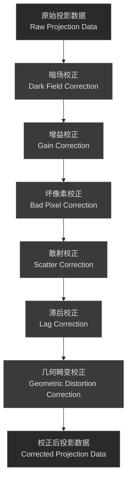
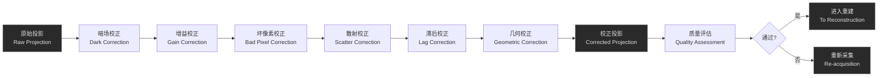

# 2.3 X-ray：直接成像的校正

## 引言

与 CT 扫描不同，X-ray 直接成像（Digital Radiography, DR）是一种投影成像技术，通过单次或少数几次曝光获得二维投影图像。现代 X-ray 系统采用平板探测器（Flat Panel Detector, FPD），这种探测器具有高分辨率、高灵敏度的特点，但同时也引入了新的校正需求。

本小节将深入探讨 X-ray 直接成像的预处理流程，包括探测器的工作原理、各种校正步骤的详细算法，以及与 CT 预处理的区别。

### 本章的核心问题

1. **X-ray 平板探测器如何工作？** 不同类型的探测器有什么优缺点？
2. **X-ray 直接成像需要哪些校正步骤？** 每个步骤的物理原理是什么？
3. **X-ray 和 CT 的预处理有什么区别？** 为什么需要不同的校正方法？

::: tip 💡 X-ray 预处理的重要性
X-ray 直接成像的图像质量直接取决于预处理的质量。不完全的校正会导致图像伪影、对比度降低和诊断准确性下降。
:::

---

## X-ray 平板探测器与信号采集

### 平板探测器的基本结构

现代 X-ray 系统多采用平板探测器（FPD），本质上是由 X-ray 转换层、光（或电）信号转换层、TFT 像素阵列和读出电子学组成的二维阵列，典型像素尺寸约 100–200 μm，阵列规模在 1k×1k–4k×4k，对应 200×200–400×400 mm 视野，可在 30–60 fps 下实时成像。

::: info 💡 平板探测器的优势
相比传统 X-ray 胶片和影像增强管，FPD 具有更高分辨率、更低噪声、更大的动态范围和更好的实时性，是当前临床的主流方案。
:::


*X-ray平板探测器（Flat Panel Detector）：现代数字X射线成像系统的核心组件*

---

### X-ray 探测器的两种类型


*传统X-ray屏-胶片探测器结构示意图：作为对比，现代平板探测器已取代了这种传统方案*

#### 间接转换型探测器（Indirect Conversion）

采用 CsI/CaWO₄ 闪烁体 + a-Si 光电二极管 + TFT 结构：X-ray 先在闪烁体中转化为可见光，再由光电二极管产生电荷并通过 TFT 读出。通常量子效率 60–80%，空间分辨率约 3–5 lp/mm，噪声较低、成本较低，但存在光扩散导致的分辨率受限以及闪烁体衰减带来的滞后伪影。

#### 直接转换型探测器（Direct Conversion）

采用 200–400 μm 厚 a-Se 光导体 + TFT：X-ray 在 a-Se 中直接产生电子–空穴对，在电场作用下漂移并被 TFT 读出。量子效率可达 70–90%，空间分辨率约 5–7 lp/mm，无光扩散、成像更锐利，但成本更高、对温度更敏感，且滞后和带电累积问题更突出。

#### 探测器类型对比

| 特性 | 间接转换（a-Si + CsI） | 直接转换（a-Se） |
|------|----------------------|-----------------|
| **量子效率** | 60-80% | 70-90% |
| **空间分辨率** | 3-5 lp/mm | 5-7 lp/mm |
| **成本** | 低 | 高 |
| **成熟度** | 高 | 中等 |
| **滞后伪影** | 中等 | 可能较明显 |
| **温度敏感性** | 低 | 高 |
| **临床应用** | 广泛 | 高端应用 |


*平板探测器的X光透视图：可以看到内部的TFT像素阵列和读出电路结构*

---

## X-ray 直接成像的校正流程

### 校正流程概述

X-ray 直接成像的预处理包含以下主要步骤：



::: tip 💡 校正流程的重要性
这个校正流程的顺序很重要。暗场校正必须首先进行，因为后续的校正都依赖于正确的暗场基准。增益校正应该在暗场校正之后进行，以消除像素间的响应差异。
:::

---

### 暗场校正（Dark Field Correction）

**原理**：探测器在无 X-ray 照射时仍会产生由热噪声、漏电流、电子学噪声和 TFT 固有特性组成的暗场信号，如果不去除，会在后续图像中形成固定图样噪声。

**算法步骤（单像素 i）**：

1. **采集暗场参考**：在完全无照射条件下采集 $N_{\text{dark}}$ 帧暗场图像（通常 10–100 帧）。
2. **计算暗场平均值**：
   $$I_{\text{dark}, i} = \frac{1}{N_{\text{dark}}} \sum_{k=1}^{N_{\text{dark}}} I_{\text{dark}, i}^{(k)}$$
3. **计算暗场标准差（用于质控）**：
   $$\sigma_{\text{dark}, i} = \sqrt{\frac{1}{N_{\text{dark}}} \sum_{k=1}^{N_{\text{dark}}} (I_{\text{dark}, i}^{(k)} - I_{\text{dark}, i})^2}$$
4. **应用暗场校正**：
   $$I_{\text{corrected}, i} = I_{\text{measured}, i} - I_{\text{dark}, i}$$

**质量控制要点**：

- $\sigma_{\text{dark}, i}$ 一般要求 < 平均暗场的 1%，暗场值在合理 ADU 范围内，空间分布相对平滑。
- 暗场模板需随时间、温度和设备老化定期更新（例如每日或每次开机后重新采集）。

::: warning ⚠️ 暗场校正的重要性
暗场未被充分扣除时，固定噪声模式会叠加在所有图像上，即使后续增益、散射等步骤做得再好，底噪也难以完全消除。
:::

---

### 增益校正（Gain Correction / Flat Field Correction）

**原理**：由于制造公差和束流分布不均匀，不同像素对相同照射条件下的响应略有差异。增益校正通过平场参考把各像素归一到统一响应。

**算法步骤**：

1. **采集平场参考**：在均匀 X-ray 照射下采集 $N_{\text{flat}}$ 帧平场图像（照射条件尽量接近临床使用）。
2. **计算平场平均值**：
   $$I_{\text{flat}, i} = \frac{1}{N_{\text{flat}}} \sum_{k=1}^{N_{\text{flat}}} I_{\text{flat}, i}^{(k)}$$
3. **计算参考强度**（可用全局中位数或平均值）：
   $$I_{\text{ref}} = \text{median}(I_{\text{flat}, i})$$
   或
   $$I_{\text{ref}} = \frac{1}{N_{\text{pixel}}} \sum_{i=1}^{N_{\text{pixel}}} I_{\text{flat}, i}$$
4. **计算增益系数并应用校正**：
   $$G_i = \frac{I_{\text{ref}}}{I_{\text{flat}, i}}, \quad I_{\text{corrected}, i} = (I_{\text{measured}, i} - I_{\text{dark}, i}) \times G_i$$

**质量控制要点**：

- 大部分像素的 $G_i$ 应集中在 0.9–1.1 之间，标准差 < 5%，空间分布平滑。
- 为补偿 X-ray 管 heel effect，现代系统常采用位置相关的 $G_i$ 或多 kVp 条件下的多套增益模板。

::: tip 💡 增益校正的实际应用
在日常 QC 中，平场图像既用于生成增益模板，也用于监控探测器是否出现新的大面积不均匀区域，从而及早发现硬件问题。
:::

---

### 坏像素校正（Bad Pixel Correction）

**原理**：由于制造缺陷或长期使用，探测器中会出现响应异常的像素，包括**死像素**（始终为 0）、**热像素**（信号异常高）、**卡住的像素**（信号固定）和**噪声像素**（噪声极大）。这些像素如果不处理，会在平场图像中形成亮/暗点，在临床图像中形成局部伪影。

**坏像素检测（常用三种思路）**：

- **基于增益系数**：在增益校准中，如果
  $G_i < 0.5$ 或 $G_i > 2.0$，表示像素 $i$ 的响应与周围像素差异过大，可标记为坏像素（阈值可按系统特性调整）。
- **基于暗场噪声**：利用暗场标准差
  $$\sigma_{\text{dark}, i} = \sqrt{\frac{1}{N_{\text{dark}}} \sum_{k=1}^{N_{\text{dark}}} (I_{\text{dark}, i}^{(k)} - I_{\text{dark}, i})^2}$$
  若 $\sigma_{\text{dark}, i} > 3 \times \text{median}(\sigma_{\text{dark}})$，说明该像素噪声异常高。
- **基于平场稳定性**：计算平场方差，若
  $$\text{Var}(I_{\text{flat}, i}) > 3 \times \text{median}(\text{Var}(I_{\text{flat}}))$$
  也可认为该像素不稳定。

**坏像素校正（插值思路）**：

- **邻域平均插值**：
  $$I_{\text{corrected}, i} = \frac{1}{N_{\text{neighbor}}} \sum_{j \in \text{neighbors}} I_{\text{corrected}, j}$$
  其中 neighbors 为 4/8 邻域，优点是实现简单，适合坏像素较少的情况。
- **加权插值**：
  $$I_{\text{corrected}, i} = \frac{\sum_{j \in \text{neighbors}} w_j \times I_{\text{corrected}, j}}{\sum_{j \in \text{neighbors}} w_j}, \quad w_j = \frac{1}{d_{ij}^2}$$
  其中 $d_{ij}$ 为像素间距离，可更好地保留空间细节。
- **双线性插值（规则网格时常用）**：
  $$I_{\text{corrected}, i,j} = (1-\alpha)(1-\beta) I_{i,j} + \alpha(1-\beta) I_{i+1,j} + (1-\alpha)\beta I_{i,j+1} + \alpha\beta I_{i+1,j+1}$$
  其中 $\alpha, \beta \in [0, 1]$ 表示坏像素在周围 4 个像素之间的相对位置。

**质量控制（精简版）**：

- 坏像素总数通常要求 < 总像素数的 0.1%，且不应成簇分布。
- 校正后区域的灰度和噪声应与周围正常区域一致。
- 长期监测坏像素数量，如增长过快需考虑探测器维护。

::: info 💡 坏像素校正的实际应用
现代 X-ray 系统在出厂时会进行初始坏像素标定，临床使用中通常按周或按月复查坏像素列表。某些高端系统已经开始尝试用深度学习替代传统阈值+插值方法，以在保证诊断价值的前提下更好地保留细节。
:::

---

### 散射校正（Scatter Correction）

**原理**：X-ray 在患者体内发生康普顿散射后，散射光子也会被探测器记录，导致投影值偏高、对比度下降和条纹伪影。可以简化为：

- **投影值偏高**：$p_{\text{measured}} = p_{\text{true}} + p_{\text{scatter}}$

散射校正的目标是在不过度增加剂量的前提下，估计 $p_{\text{scatter}}$ 并从测量的投影中减去。

#### 硬件方法：反散射栅

使用铅条+透射间隙的物理栅格抑制散射。典型参数包括：铅条间距约 1-2 mm、栅比 12:1–16:1、焦点距离（FFD）100-150 cm。常见性能为：散射消除率约 60-80%，一次光子透射率 70-85%，因此需要相应提高曝光（栅因子约 1.2-1.5）。

#### 软件方法：散射场估计与扣除

无论是使用小孔径准直器实测、基于患者轮廓的蒙特卡洛模拟，还是卷积神经网络（CNN），本质上都是估计一个平滑的散射场 $p_{\text{scatter}}(x,y)$：

$$p_{\text{scatter}}(x, y) = f(\text{patient geometry}, \text{X-ray spectrum}, x, y)$$

其中 $f$ 表示与患者几何和 X-ray 能谱相关的散射分布函数。得到散射场后，在投影域中进行扣除：

$$p_{\text{corrected}}(x, y) = p_{\text{measured}}(x, y) - p_{\text{scatter}}(x, y)$$

为避免过度校正，实际系统中通常加入权重因子 $\alpha$ 并进行截断：

$$p_{\text{corrected}}(x, y) = \max\big(p_{\text{measured}}(x, y) - \alpha \times p_{\text{scatter}}(x, y), 0\big)$$

其中 $\alpha$ 一般在 0.5-1.0 之间，根据系统特性和噪声水平调节。

**散射校正方法对比**：

| 方法 | 散射消除率 | 计算时间 | 复杂度 | 应用场景 |
|------|----------|--------|------|--------|
| **反散射栅** | 60-80% | 0 ms | 低 | 标准 X-ray |
| **小孔径准直** | 70-90% | 100-500 ms | 中 | 高精度应用 |
| **蒙特卡洛模拟** | 80-95% | 1-10 s | 高 | 研究和特殊应用 |
| **机器学习** | 85-95% | < 100 ms | 高 | 实时应用 |

::: warning ⚠️ 散射校正的挑战
散射分布由患者体型、照射野大小、kVp 等多因素共同决定。过度校正（例如 $\alpha$ 过大或模型偏差）会放大噪声甚至产生负投影值，因此在临床系统中通常会对校正强度设上下限，并通过体模实验反复调参。
:::

---

### 滞后校正（Lag Correction）

**原理**：滞后（Lag）是指探测器在一帧曝光结束后仍保留部分信号到后续帧，表现为运动结构后方的淡淡“鬼影”（Ghosting）。其来源包括闪烁体衰减时间（间接转换型 CsI，通常 1–10 μs）、a-Se 光导体中的电荷陷阱（释放时间可达 ms 级）、TFT 阵列的充放电特性以及读出电路残余积分等。

**典型特征**：
- 鬼影：在快速运动结构后方出现弱重影；
- 时间依赖：在动态透视成像中最明显；
- 残余幅度：通常为前一帧信号的 1–5%，可影响多帧。

#### 数学模型

常用的离散帧间模型包括：

- **一阶滞后模型**：
  $$I_{\text{lag}}^{(n)} = \alpha \times I_{\text{measured}}^{(n-1)}$$

- **二阶滞后模型**：
  $$I_{\text{lag}}^{(n)} = \alpha \times I_{\text{measured}}^{(n-1)} + \beta \times I_{\text{lag}}^{(n-1)}$$

  其中 $\alpha$ 通常在 0.01–0.05，$\beta$ 通常在 0.1–0.3。

- **多阶滞后模型**：
  $$I_{\text{lag}}^{(n)} = \sum_{k=1}^{K} \alpha_k \times I_{\text{measured}}^{(n-k)}$$

  其中 $K$ 为滞后阶数（一般 2–5）。

#### 滞后测量与校正

通过交替采集黑/白图像可估计模型参数：

1. 采集全黑图像（无 X-ray）：$I_{\text{black}}^{(n)}$
2. 采集全白图像（最大 X-ray）：$I_{\text{white}}^{(n)}$
3. 交替采集黑白图像序列，在黑帧中测量残余信号：
   $$I_{\text{residual}}^{(n)} = I_{\text{black}}^{(n)} - I_{\text{dark}}$$
4. 例如一阶模型中，可估计
   $$\alpha = \frac{I_{\text{residual}}^{(n)}}{I_{\text{white}}^{(n-1)}}$$

得到 $I_{\text{lag}}^{(n)}$ 的模型后，对每一帧进行校正：
$$I_{\text{corrected}}^{(n)} = I_{\text{measured}}^{(n)} - I_{\text{lag}}^{(n)}$$

**质量控制要点（精简版）**：

- 滞后系数 $\alpha$ 一般要求 < 5%，较大时需重新标定或检查探测器状态。
- 校正后鬼影残余应 < 1%，动态序列的对比度通常可提高约 10–20%。
- 校正过程不应显著降低时间分辨率。

::: warning ⚠️ 滞后校正的挑战
滞后在心血管造影等快速透视场景中尤为明显，但精确建模并不容易。除软件校正外，部分高端系统还通过快速复位电路、对 a-Se 施加前向偏置、多次采样等硬件手段减少滞后，从源头上降低鬼影风险。
:::

---

### 几何畸变校正（Geometric Distortion Correction）

**原理**：由于 X-ray 源的点源特性和探测器几何配置，投影图像可能产生桶形/枕形畸变、径向偏移和切向扭曲等几何失真，其来源包括源位置偏心、探测器倾斜、光学系统非线性以及温度导致的机械变形等。在需要定量测量或导航的场景中必须进行校正。

#### 标定与建模

1. **采集校准图像**：使用棋盘格、圆点阵或线性标靶，在整个 FOV 内均匀布置标记物并拍摄校准图像。
2. **检测标记物位置**：利用图像处理算法（边缘/角点/圆形检测等）自动获得每个标记物的实际坐标 $(x_{\text{measured}}, y_{\text{measured}})$，并与理想坐标 $(x_{\text{ideal}}, y_{\text{ideal}})$ 对应。
3. **计算位置偏差**：
   $$\Delta x = x_{\text{measured}} - x_{\text{ideal}},\quad \Delta y = y_{\text{measured}} - y_{\text{ideal}}$$

根据这些偏差拟合几何畸变模型。常见模型包括：

- **径向畸变模型**：
  $$r_{\text{corrected}} = r_{\text{measured}} (1 + k_1 r_{\text{measured}}^2 + k_2 r_{\text{measured}}^4 + k_3 r_{\text{measured}}^6 + \ldots)$$

  其中 $r_{\text{measured}} = \sqrt{(x_{\text{measured}} - x_c)^2 + (y_{\text{measured}} - y_c)^2}$ 表示到图像中心 $(x_c, y_c)$ 的径向距离，$k_1, k_2, k_3$ 为径向畸变系数。

- **切向畸变模型**：
  $$x_{\text{corrected}} = x_{\text{measured}} + (p_1 (r^2 + 2x_{\text{measured}}^2) + 2p_2 x_{\text{measured}} y_{\text{measured}})$$
  $$y_{\text{corrected}} = y_{\text{measured}} + (p_2 (r^2 + 2y_{\text{measured}}^2) + 2p_1 x_{\text{measured}} y_{\text{measured}})$$

  其中 $p_1, p_2$ 为切向畸变系数，$r$ 为到图像中心的径向距离。

整体可写成矩阵形式：
$$\begin{pmatrix} x_{\text{corrected}} \\ y_{\text{corrected}} \end{pmatrix} = \begin{pmatrix} x_{\text{measured}} \\ y_{\text{measured}} \end{pmatrix} + \text{径向畸变} + \text{切向畸变}$$

参数通常通过最小二乘法拟合，最小化
$$\sum_i (\Delta x_i^2 + \Delta y_i^2)$$
并使用 20–50 个分布良好的标记点即可获得足够精度。

#### 图像重采样与质控

对每个像素 $(x, y)$，根据模型计算其校正后位置 $(x_{\text{corrected}}, y_{\text{corrected}})$，再通过插值获得新图像值。常用插值方法有最近邻、双线性和双三次插值，临床系统中多采用在速度和质量之间折中的**双线性插值**。

**质量控制要点**：

- 校正后网格应接近理想直线，残余畸变 < 0.5 像素；
- MTF 变化一般要求 < 5%，避免明显空间分辨率损失；
- 对于骨密度测量、术前规划等定量应用，应定期（如每月）重新标定几何畸变。

::: tip 💡 几何畸变校正的重要性
几何畸变校正对于需要精确测量的应用（如骨密度测量、手术导航）特别重要。不完全的几何校正会导致测量误差和定位不准确。
:::

---

## X-ray 与 CT 预处理的区别

### 投影几何的差异

| 特性 | X-ray 直接成像 | CT 扫描 |
|------|--------------|--------|
| **投影几何** | 平行束或点源投影 | 扇形束或锥形束 |
| **采集方式** | 单次或少数几次曝光 | 旋转扫描，多角度投影 |
| **探测器** | 二维平板探测器 | 一维或二维探测器阵列 |
| **数据量** | 相对较少 | 大量投影数据 |
| **时间分辨率** | 高（实时成像） | 低（需要旋转） |
| **空间分辨率** | 高（2D 成像） | 中等（3D 成像） |
| **对比度分辨率** | 低（单次投影） | 高（多角度投影） |

### 校正流程的详细对比

**相同的校正步骤**：
- 暗场校正：都需要消除热噪声和漏电流
- 增益校正：都需要消除像素间的响应差异
- 坏像素校正：都需要处理故障像素
- 散射校正：都需要减少散射信号

**X-ray 特有的校正步骤**：
- **滞后校正**：动态成像中重要，CT 中不需要（旋转扫描时间长）
- **几何畸变校正**：由于点源投影导致的几何失真

**CT 特有的校正步骤**：
- **空气校正**：获取无物体时的参考投影
- **射束硬化校正**：多色 X-ray 的能谱变化
- **环形伪影校正**：旋转扫描中探测器故障导致

**校正顺序的差异**：

**X-ray 校正流程**：
```
暗场校正 → 增益校正 → 坏像素校正 → 散射校正 → 滞后校正 → 几何畸变校正
```

**CT 校正流程**：
```
暗场校正 → 增益校正 → 空气校正 → 射束硬化校正 → 散射校正 → 环形伪影校正
```

### 校正参数的差异

| 参数 | X-ray | CT |
|------|-------|-----|
| **暗场采集** | 无 X-ray 照射 | 无 X-ray 照射 |
| **增益采集** | 均匀 X-ray 照射 | 均匀 X-ray 照射 |
| **空气校正** | 不需要 | 需要（无物体投影） |
| **滞后系数** | 1-5% | 不适用 |
| **几何畸变** | 需要校正 | 通常不需要（旋转扫描自动补偿） |
| **射束硬化** | 不需要（单次投影） | 需要（多角度投影） |
| **环形伪影** | 不需要 | 需要（旋转扫描） |

### 预处理复杂度对比

总体上，X-ray 预处理多为像素级运算，流程相对简单、速度快，可支持逐帧实时处理；CT 预处理则需同时考虑投影几何和能谱等物理效应，计算量更大，常以离线或批处理方式完成，并强调多角度投影间的一致性及射束硬化等模型精度。

### 预处理流程对比图

```mermaid
graph TD
    subgraph XRay["X-ray 直接成像"]
        X1["原始投影"] --> X2["暗场校正"]
        X2 --> X3["增益校正"]
        X3 --> X4["坏像素校正"]
        X4 --> X5["散射校正"]
        X5 --> X6["滞后校正"]
        X6 --> X7["几何畸变校正"]
        X7 --> X8["校正投影"]
    end

    subgraph CT["CT 扫描"]
        C1["原始投影"] --> C2["暗场校正"]
        C2 --> C3["增益校正"]
        C3 --> C4["空气校正"]
        C4 --> C5["射束硬化校正"]
        C5 --> C6["散射校正"]
        C6 --> C7["环形伪影校正"]
        C7 --> C8["校正投影"]
    end

    style X1 fill:#2a2a2a,stroke:#666,color:#e0e0e0
    style X8 fill:#2a2a2a,stroke:#666,color:#e0e0e0
    style C1 fill:#2a2a2a,stroke:#666,color:#e0e0e0
    style C8 fill:#2a2a2a,stroke:#666,color:#e0e0e0
```



### 预处理时间对比

| 步骤 | X-ray | CT |
|------|-------|-----|
| **暗场校正** | < 1 ms | < 1 ms |
| **增益校正** | < 1 ms | < 1 ms |
| **坏像素校正** | < 1 ms | < 1 ms |
| **散射校正** | 1-100 ms | 100-1000 ms |
| **滞后校正** | < 1 ms | 不适用 |
| **几何畸变校正** | 10-50 ms | 不适用 |
| **射束硬化校正** | 不适用 | 100-500 ms |
| **环形伪影校正** | 不适用 | 50-200 ms |
| **总计** | 12-152 ms | 251-1702 ms |

**注**：时间取决于图像大小、算法复杂度和硬件性能。

---

## 数据流和质量控制

### 完整的预处理流程



### 质量控制指标

- **投影数据**：通常要求 SNR > 50 dB、CNR > 10，充分利用 12–16 bit 动态范围，伪影水平控制在图像强度的约 5% 以内。
- **预处理结果**：暗场残余 < 1%，增益不均匀性 < 5%，坏像素比例 < 0.1%，几何误差 < 0.5 像素。

::: tip 💡 质量控制的重要性
定期的质量控制检查可以及早发现系统问题，确保诊断图像的质量。临床上常采用“每日快速检查 + 每周详细评估”的组合策略。
:::

---

## 总结与衔接

### 本章的核心内容

本章围绕 X-ray 平板探测器的类型与工作原理，系统介绍了暗场、增益、坏像素、散射、滞后和几何畸变六个校正步骤的数学模型与实现思路，并给出了若干关键的质量控制指标。

### 与 CT 预处理的关键区别

相比 CT 多角度投影及其射束硬化、环形伪影等特有问题，X-ray 直接成像以单次投影为主，预处理更侧重像素级均匀性、滞后和几何畸变控制：前者更关注三维成像精度，后者强调二维图像的实时性和稳定性。

### 与下一章的衔接

校正后的投影数据将进入第 3 章的图像重建阶段。不同投影几何（平行束、扇形束、锥形束）对应不同重建算法，理解本章的预处理与投影几何将有助于后续学习。

::: info 💡 下一步学习
在阅读重建算法之前，可以先回顾第 1 章的投影几何与本章的数据流，思考它们如何共同决定最终图像质量。
:::

---

**相关资源**：
- AAPM Task Group Reports on X-ray detector quality assurance
- Varian, Siemens, GE 等厂商的技术文档
- 医学物理学术期刊上的相关论文

## 📎 图片引用来源

- X-ray平板探测器：[Wikimedia Commons - Flat panel detector](https://commons.wikimedia.org/wiki/File:Flat_panel_detector.jpg)，CC BY-SA 3.0
- 平板探测器内部结构：[Wikimedia Commons - XrayOfAPlatPanelDetector](https://commons.wikimedia.org/wiki/File:XrayOfAPlatPanelDetector.jpg)，CC BY-SA 4.0
- 传统屏-胶片探测器结构：[Wikimedia Commons - Screen-film detector](https://commons.wikimedia.org/wiki/File:Screen_-_film_detector,_used_in_conventional_radiography.png)，CC BY 3.0